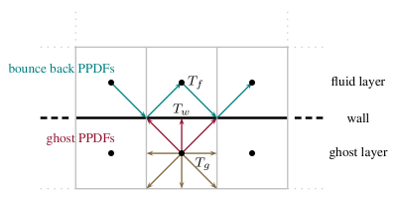

# Documentation Examples # {#dvExamples}

[TOC]

This page currently is a place to save useful examples that can be used in Doxygen. You can get more information in the [Doxygen documentation](https://doxygen.nl/manual/index.html).  
The section about the [Markdown support](https://doxygen.nl/manual/markdown.html) is especially useful.

Empty lines are preserved.

To get a line break you have to add two spaces to the end of the line.  
Like this.
Otherwise, line breaks are ignored.

@note This is a note.

[This](@ref mmLBE) is an example link to some page. If you just use the \@ref command it will use the title of the page
as its text: @ref mmLBE.

Here is an example of a reference to a class MAIAFvCartesianSolverXD. You just have to write the name of the class an doxygen will do the rest.  
This also works for functions MAIALbSolver::noInternalCells() and variables MAIALbSolver::m_cells.  

@warning This is a warning! You can still <em> use formatting </em> in these <b> blocks </b>.

This function has the wrong input parameters MAIALbSolver::a_variable() but Doxygen still links the function.  
This would be correct: MAIALbSolver::a_variable(const MInt, const MInt)  
I did not find a way to specify a specific version of a function. This for example links to the wrong one:
void MAIALbSolverDxQy<3, 27>::cumulant_collision_step()  

You can use the \\page command in the C++ code to add information about the function to a specific page.
However, you have to use the very specific syntax otherwise the page will not be rendered in the order.  
The auto-generated List of all collision steps of the LB solver is linked [here](@ref collisionStep) as an example.  

Doxygen takes quite a long time to parse the whole code. To quickly compile the documentation without references to the code modify the `doc/Doxyfile` at line 784:  
```
INPUT = ./pages
```  
Without the \\ at the end of the line and `@CMAKE_SOURCE_DIR@/@SRC_DIR@` in the next line. This change is reverted when you run the `configure.py` script, which may happen automatically if you `git pull`.

# Types of sections
## Subsection
You can see the outline of the current page by expanding the page with the litte arrow next to the page name. This page also has a table of contents. This is due to the \[TOC\] at the start of the page's source code.
### Subsubsection
#### Onions have layers
This is the last sublayer of sections that is rendered in the outline or the table of contents on the right side.
##### More layers
The headings are getting smaller and smaller...
###### How many layers of sections can you have?

## How to include an image
Some text

more text.  

## Example for a section with LaTeX formulas
The particle probability distribution function (PPDF) \f$ f(\mv{x},\mv{\xi},t) \f$
represents the probability of particles to appear in momentum space at the
position \f$ \mv{x} \f$ and time \f$ t \f$ with a velocity of \f$ \mv{\xi} \f$.

Macroscopic quantities such as density, velocity, or energy
(\f$\rho , \mv{u}, E\f$) are connected to this mesoscopic quantity \f$ f \f$ by
its raw moments
\f{align}{
  \rho(\mv{x},t)            &= \iiint               f(\mv{x},\mv{\xi},t) d\mv{\xi}  \,, \\
  \rho(\mv{x},t)u(\mv{x},t) &= \iiint  \mv{\xi}     f(\mv{x},\mv{\xi},t) d\mv{\xi}  \,, \text{and}\\
  2\rho(\mv{x},t)E(\mv{x},t) &= \iiint |\mv{\xi}|^2  f(\mv{x},\mv{\xi},t) d\mv{\xi} \,.
\f}

You can go quite big:  

@f$A
\cdot
\left(
    \begin{array}{c}    
        p_{200}\\
        p_{020}\\
        p_{002}\\
        p_{110}\\
        p_{101}\\
        p_{011}\\
        p_{100}\\
        p_{010}\\
        p_{001}\\
        p_{000}\\
    \end{array}
\right)
=
\left(
\begin{array}{c}    
\sum{{x_j}^2 u_{i}(x_j)}\\
\sum{{y_j}^2 u_{i}(x_j)}\\
\sum{{z_j}^2 u_{i}(x_j)}\\
\sum{x_j y_j u_{i}(x_j)}\\
\sum{x_j z_j u_{i}(x_j)}\\
\sum{y_j z_j u_{i}(x_j)}\\
\sum{x_j u_{i}(x_j)}\\
\sum{y_j u_{i}(x_j)}\\
\sum{z_j u_{i}(x_j)}\\
\sum{u_{i}(x_j)}\\
\end{array}
\right)@f$

with

@f$A = \left(
\begin{array}{cccccccccc}
\sum x_j^4&\sum x_j^2 y_j^2&\sum x_j^2 z_j^2&\sum x_j^3 y_j&\sum x_j^3 z_j&\sum x_j^2 y_j z_j&\sum x_j^3&\sum x_j^2 y_j&\sum x_j^2 z_j&\sum x_j^2\\
\sum x_j^2 y_j^2&\sum y_j^4&\sum y_j^2 z_j^2&\sum x_j y_j^3&\sum x_j y_j^2 z_j&\sum y_j^3 z_j&\sum x_j y_j^2&\sum y_j^3&\sum y_j^2 z_j&\sum y_j^2\\
\sum x_j^2 z_j^2&\sum y_j^2 z_j^2&\sum z_j^4&\sum x_j y_j z_j^2&\sum x_j z_j^3&\sum y_j z_j^3&\sum x_j z_j^2&\sum y_j z_j^2&\sum z_j^3&\sum z_j^2\\
\sum x_j^3 y_j&\sum x_j y_j^3&\sum x_j y_j z_j^2&\sum x_j^2 y_j^2&\sum x_j^2 y_j z_j&\sum x_j y_j^2 z_j&\sum x_j^2 y_j&\sum x_j y_j^2&\sum x_jy_jz_j&\sum x_jy_j\\
\sum x_j^3 z_j&\sum x_j y_j^2 z_j&\sum x_j z_j^3&\sum x_j^2 y_jz_j&\sum x_j^2 z_j^2&\sum x_jy_j z_j^2&\sum x_j^2 z_j&\sum x_jy_jz_j&\sum x_j z_j^2&\sum x_jz_j\\
\sum x_j^2 y_jz_j&\sum y_j^3 z_j&\sum y_j z_j^3&\sum x_j y_j^2 z_j&\sum x_jy_jz_j^2&\sum y_j^2 z_j^2&\sum x_jy_jz_j&\sum y_j^2 z_j&\sum y_j z_j^2&\sum y_jz_j\\
\sum x_j^3&\sum x_j y_j^2&\sum x_j z_j^2&\sum x_j^2 y_j&\sum x_j^2 z_j&\sum x_jy_jz_j&\sum x_j^2&\sum x_jy_j&\sum x_jz_j&\sum x_j\\
\sum x_j^2 y_j&\sum y_j^3&\sum y_j z_j^2&\sum x_j y_j^2&\sum x_jy_jz_j&\sum y_j^2 z_j&\sum x_jy_j&\sum y_j^2&\sum y_jz_j&\sum y_j\\
\sum x_j^2 z_j&\sum y_j^2 z_j&\sum z_j^3&\sum x_jy_jz_j&\sum x_j z_j^2&\sum y_j z_j^2&\sum x_jz_j&\sum y_jz_j&\sum z_j^2&\sum z_j\\
\sum x_j^2&\sum y_j^2&\sum z_j^2&\sum x_jy_j&\sum x_jz_j&\sum y_jz_j&\sum x_j&\sum y_j&\sum z_j&N\\
\end{array}
\right)@f$


### Example on how to include citations
Some text with a citation [[Bhatnagar1954]]

## References
* P. L. Bhatnagar, E. P. Gross, and M. Krook, A Model for Collision Processes
in Gases. I. Small Amplitude Processes in Charged and Neutral One-Component
Systems, Phys. Rev., 94, 511–525, May 1954, [10.1103/PhysRev.94.511][Bhatnagar1954].

[Bhatnagar1954]: https://doi.org/10.1103/PhysRev.94.511

# An example for a table
<table>
<tr><th>Variable</th>                     <th>Equation</th></tr>
<tr><td>Velocity                     </td>  <td>@f$u^*=\frac{u}{\xi_0}@f$</td></tr>
<tr><td>Isothermal speed of sound    </td>  <td>@f$c_s^*=\frac{c_s}{\xi_0}=\sqrt{\frac{1}{3}}@f$</td></tr>
<tr><td>Molecular velocity           </td>  <td>@f$\xi_0^*=\frac{\xi_0}{\xi_0}=1@f$</td></tr>
<tr><td>Grid distance                </td>  <td>@f$\delta x^*=\frac{\delta x}{\delta x}=1@f$</td></tr>
<tr><td>Characteristic Length        </td>  <td>@f$L^*=\frac{L}{\delta x}@f$</td></tr>
<tr><td>Time step                    </td>  <td>@f$\delta t^*=\frac{\delta t \cdot \xi_0}{\delta x} = 1@f$</td></tr>
<tr><td>Density                      </td>  <td>@f$\rho^*=\frac{\rho}{\rho_0}@f$</td></tr>
<tr><td>Pressure                     </td>  <td>@f$p^*=\frac{p}{\rho_0 \cdot \xi_0^2}@f$</td></tr>
<tr><td>Collision Operator           </td>  <td>@f$\Omega_c^* = \omega_c \cdot \delta t = \frac{2}{6 \cdot \nu^* + 1}@f$</td></tr>
<tr><td>Temperature                  </td>  <td>@f$T^*=\frac{T}{T_0}@f$</td></tr>
<tr><td>Thermal diffusivity          </td>  <td>@f$\kappa^*=\frac{\nu^*}{Pr}@f$</td></tr>
<tr><td>Collision Operator (thermal) </td>  <td>@f$\Omega_T^* = \omega_T \cdot \delta t = \frac{2}{6 \cdot \frac{\nu^*}{Pr} + 1}@f$</td></tr>
</table>

    rankdir = "LR";