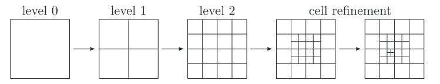

# Adaptive mesh refinement (AMR) # {#nmAMR}

The adaptive mesh refinement allows for local refinement of the Cartesian mesh based on local sensor data. Here, the term *sensor* refers to different metrics deciding on whether to refine or coarsen a cell on a per-cell basis ([AMR](@ref ugAMR)).

From a conceptional standpoint, the adaptive mesh refinement makes use of the octree structure in three-dimensional space (quadtree in 2d) of the unstructured grid modality. That is, the cell tree is characterized by a hierachical tree-structure in which each cell has is part of a leaf characterized by parent and children relations. For the adaptive mesh refinement, a number of child cells are added onto (refinement) or removed (coarsened) the local tree path based on the given sensor data ([CG](@ref nmCartesianGrid)). 

Due to the parallelization method employd, each solver can adapt its grid independent of other solvers in multi-solver environments (ref parallelization, ref coupling).

## Sensors
The triggering of the adaptive mesh refinement is determined by local sensors in each cartesian cell. Here, two distinctions are made: sensors based on information of the flow field (solution adaptive) and sensors based on static information.

Sensors, which are based on information from the flow field, evaluate a corresponding variable against a reference value and trigger the adaptation accordingly. To be more specific, the specified cell variable connected to the sensor is compared against the root-mean-square (RMS) and the adaptation is induced if a specified threshold is eclipsed. While sensors can be linked to a simple cell variable, e.g., the cell pressure, more complex variables, such as the derivative of a variable in spatial direction, are possible.

The other kind of sensors are static sensors, i.e., sensors which extract no information from the flow field but rather are based on static information. Here, examples would be the *interface* sensor which defines the area surrounding a moving body for a specified distance, or the *patch* sensor which refines a specified area of the domain.

The evluation of all sensors is triggered either in pre-defined intervals ([AMR](@ref ugAMR)) or adaptively when necessary.

### Possible Sensors
<table>
<tr><th>Sensor         </th> <th>Description                                                                      </th></tr>
<tr><td>Derivative     </td> <td>Refines based on the RMS of all variables by a simple finite difference stencil  </td></tr>
<tr><td>Solidus        </td> <td>Refines based on cells intersecting the solidus interface                        </td></tr>
<tr><td>Divergence     </td> <td>Refines based on the cell divergence by forward and backward central differences </td></tr>
<tr><td>TotalPressure  </td> <td>Refines based on the cell total pressure                                         </td></tr>
<tr><td>EntropyGrad    </td> <td>Refines based on the spatial RMS entropy gradient in all directions              </td></tr>
<tr><td>EntropyQuot    </td> <td>Refines based on a quotient of the normalized entropy in relation to Sinfinity   </td></tr>
<tr><td>Vorticity      </td> <td>Refines based on the spatial RMS velocity vorticity in all directions            </td></tr>
<tr><td>               </td> <td>                                                                                 </td></tr>
<tr><td>Limit          </td> <td>Simple sensor to apply refinement to a limit for a value                         </td></tr>
<tr><td>Particle       </td> <td>Refines based on the cell number of particles (Lagrangian) [uses *Limit*]        </td></tr>
<tr><td>Species        </td> <td>Refines based on the cell species concentration [uses *Limit*]                   </td></tr>
<tr><td>               </td> <td>                                                                                 </td></tr>
<tr><td>Patch          </td> <td>Refines based on a static region defined inside the grid domain                  </td></tr>
<tr><td>Interface      </td> <td>Refines based on a static distance surrounding moving boundaries                 </td></tr>
<tr><td>CutOff         </td> <td>Refines based on a static distance surrounding cutoff cells                      </td></tr>
</table>

## Refinement/Coarsening process
The different sensors supply the refinement data in the variable sensorCellFlag in which a a boolean is set for every gridcell whether the cell needs to be adapted or kept equal. If a sensor triggers a refinement, or, more specifically, a change in level of the local leaf cells, new cells are either generated as children at the current leaf cell level or children are removed and the leaf cell level is reduced for the local tree leaf.

The refinement/coarsening process is controlled by MAIACartesianGrid<nDim>::meshAdaptation(). 

Here, the process of refining and coarsening happens in a loop through all prevalent levels, that is, for all levels from the solver minLevel to the solver maxLevel. This allows large deltas between the min- and the max-level such that local high refinement levels can be computed efficiently on HPC systems.

For coarsening, the loop runs from maxLevel to minLevel which simplifies the removement of cells as it allows to remove the bottom children of a parent cell. For refinement, the loop runs from the minLevel to the maxLevel, i.e., the code successively adds children towards the leaf cell. Switching the order of the refinement/coarsening then allows the code to remove/add multiple new levels without holes or jumps in the resulting grid.

For coarsening, the volume equated sum of all child fluid variables are written into the parent cell. For refinement, the parent variables are initially written into the new child considered and subsequently updated with a conservative slope stencil to account for the varying position of the newly generated children regard to the parent cell.

The cell relations are hold by the octree structure, i.e., the tree holds cell relevant information of the location, the cell level, parent/child relationships and neighboring cell information which can, in the case of a refinement, easily be derived from the parent properties.

During the adaptation, halo/window relationships are recomputed where necessary.
