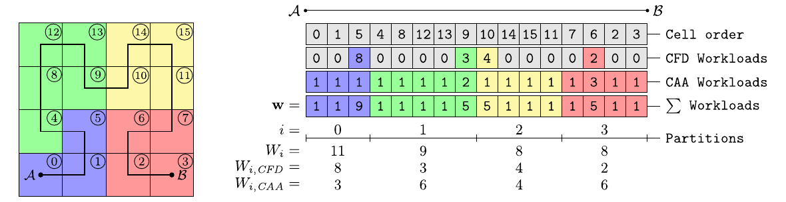
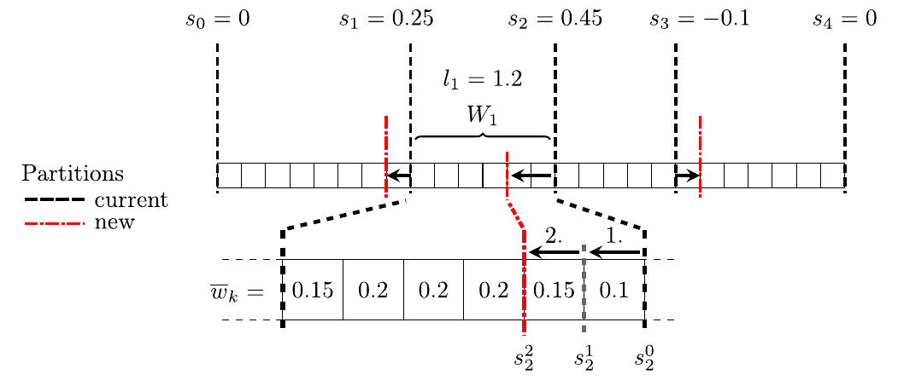

# Dynamic load balancing (DLB) # {#nmDLB}

Source: [Niemoeller2020][Niemoeller2020] (consult paper for references)

The ultimate goal of dynamic load balancing is to maximize the overall
performance of a parallel computation by redistributing the workload among
processes such that all available computing power is used to full
capacity (Hendrickson2000a). Load balancing in highly parallel
applications is key for an efficient resource usage (Ashby2010), since
even minor imbalances can have a severe impact on the performance and
scalability of the computation. Numerical simulations typically involve
frequent communication between MPI subdomains such that an aggravation of
imbalances will occur in every iteration or stage of a time step due to
synchronization (Boehme2014). Furthermore, the performance penalty is
sensitive to the specific imbalance pattern, which is
highly problem dependent. A single overloaded process will significantly
degrade performance. The reason for this is that all other processes wait and
sit idle until the communication among neighboring domains can proceed. On
the other hand, a few underloaded processes will only have a minor impact on
the overall performance. Finally, imbalances can be classified as dynamic or
static (Boehme2014). Dynamic imbalances arise if the workload
distribution varies as a function of time, which occurs, for example, when
solution adaptive meshes are used. Constant workload distributions will lead
to static imbalances.

Load imbalances and the resulting performance impact can be quantified by
different metrics. Here, the imbalance percentage (DeRose2007) defined by
\f{equation}{
  I_{\%} = \frac{(t_{max} - t_{avg})\cdot N}{t_{max}\cdot(N-1)},
  \label{eqn:imbalance_percentage}
\f}
which expresses the severity of an imbalance, is used. The quantities \f$t_{max}\f$
and \f$t_{avg}\f$ represent the maximum and average time to process a given section
of code and \f$N\f$ is the number of parallel processes. The
imbalance percentage is defined by the ratio of the total amount of time
wasted \f$(t_{max}-t_{avg}) \cdot N\f$ to the amount of parallel resources
\f$t_{max} \cdot (N-1)\f$. A value of \f$I_\%=0\%\f$ corresponds to a perfectly
balanced load distribution, while \f$I_\%=100\%\f$ is associated with a code
section executed only on a single process. Thus, the metric indicates the
amount of wasted resources. This assumes that all but the slowest process sit
idle at the end of the corresponding code section, which can be related to the
completion of a single time step or stage of a time integration scheme in a
numerical simulation. The potential run time savings are expressed by the
imbalance time \f$I_t = t_{max} - t_{avg}\f$ assuming that perfect load balance can
be achieved (DeRose2007). Furthermore, the allocation-time impact is
estimated by \f$I_T = N \cdot I_t\f$, which is an upper bound on the total amount
of wasted resources (Boehme2014).

In general, such a DLB algorithm needs to identify
load imbalances, determine the amount of workload to be transferred, select
corresponding objects to migrate, and finally, perform the relocation.

Dynamic load balancing of large-scale coupled multiphysics simulations is
inherently complex and poses various challenges. For instance, multi-stage
calculations and interleaved computations with inherent communication barriers
may prevent load balancing (Hendrickson2000, Watts1998).
The direct-hybrid method which couples an FV-CFD and DG-CAA solver is an example
for such a coupled multiphysics simulation and even for static load
distributions, a parallel computation might exhibit load imbalances.

Without load balancing, the parallel efficiency of the overall computation is
determined by the initial domain decomposition, which is based on estimates
regarding the different computational costs for CFD and CAA cells. These
estimates can be determined by relating measured run times obtained from
independent CFD and CAA simulations. However, this approach does not take into
account the idle times of all parallel subdomains or, for example, boundary
conditions that might be computationally more expensive. Consequently, the
predicted load might deviate significantly from the actual load on each
parallel subdomain during the coupled simulation (Jetley2008).

This performance impact is exacerbated when considering large-scale simulations
with relatively small domain workloads or when using heterogeneous computing
hardware (Dongarra2011). Then, a DLB method is required that
automatically redistributes the computational workload to reduce imbalances
during the simulation. In the direct-hybrid method, load balancing requires
the redistribution of mesh cells used for the fully-coupled CFD/CAA solver,
implicitly ensuring locality of the coupling acoustic sources. Furthermore, if
the flow and the acoustics domain are of different size, a change of the grid
partitioning can change the list of used parallel processes for each solver.

The present DLB algorithm is based on measurements of the computing time on each
parallel process and the current distribution of cells of all solvers in all
subdomains, new computational weights are computed. These weights are then used
to determine a new domain decomposition.

## Estimation of computational weights
Key to partitioning and load balancing of coupled multiphysics simulations is
the estimation of computational costs for different objects present in the
simulation (Menon2012). By objects the constituent parts of the numerical
setup, i.e., cells of the grid, are meant. The standard approach for
single-solver frameworks aims at distributing objects evenly among all parallel
subdomains, assuming a homogeneous computing environment and likewise constant
computational cost of each object. However, this poses difficulties if multiple
types of objects with dissimilar computational costs exist. This problem can
be reduced by using a-priori determined computational weights for each object
type, which for the direct-hybrid method includes CFD and CAA cells.
However, for complex applications this will often yield a suboptimal load
balanced domain decomposition, due to inaccurate computational weights, which
do not take into account the computational effort of all involved algorithmic
elements or inhomogeneous computing hardware.

The implemented DLB algorithm estimates computational weights based
on measurements of the computing time on each parallel subdomain. Furthermore,
the current distribution of objects of the distinct solvers among all
subdomains is incorporated. These types of objects, which can be regarded as
different load types, give rise to varying load compositions. During the
simulation, the collective compute time of all solvers and couplers is measured
locally for each time step.

On each subdomain \f$i\f$, the average compute time \f$r_i\f$ is determined as
the \f$25\%\f$ truncated mean to filter out program-external influences such as
system noise (Boehme2014,Petrini2003). With the global average compute
time among all \f$N\f$ parallel processes given by
\f{align}{
  \overline{r} = \frac{1}{N}\sum_{i=0}^{N-1} r_i,
\f}
the local computational load \f$l_i\f$ is determined as
\f{align}{\label{eq:load}
  l_i = \frac{r_i}{\overline{r}}.
\f}
Subsequently, the computational weights \f$\mv{c}\f$ for the different load types
can be estimated by solving the least squares problem \f$\mv{A}\mv{c} =
\mv{l}\f$, with the right-hand side given by the load vector \f$\mv{l} =
\left(l_0, l_1, \dots, l_{N-1}\right)^\top\f$ and the left-hand side matrix
\f$\mv{A}\f$ representing the current workload distribution among all subdomains
discussed in Fig (\link sfcpartitioning SFC example\endlink). This assumes that on average the
load can be expressed as a linear combination of the individual workload
contributions. The linear least-squares problem with unique minimum-norm
solution can be written as
\f{align}{\label{eq:weights_leastsquares}
  ||\mv{Ac}-\mv{l}||_2 = \min_{\mv{v}}
  ||\mv{Av} - \mv{l}||_2 \quad\text{and}\quad ||\mv{v}||_2 \text{ is minimal.}
\f}

The Eigen library is used to
solve the least-squares problem given in Eq. \f$\ref{eq:weights_leastsquares}\f$.
An example for this procedure with two load types distributed among \f$N = 4\f$
parallel subdomains is given in Eq.\f$~\ref{eq:weights_example}\f$. Solving the
overdetermined system of linear equations in the least-squares sense yields a
computational weight ratio of \f$2.61\f$ between the two load types. Thus, the
average compute time for the second object type is estimated to be 2.6-times
higher than that of the first one.
\f{align}{
  N \left\{
  \begin{bmatrix}
  10 & 7 \\
  13 & 4 \\
  12 & 2 \\
  5  & 8 \\
  \end{bmatrix}
  \right.
  \begin{bmatrix}
    c_0 \\
    c_1 \\
  \end{bmatrix}
  =
  \begin{bmatrix}
    1.2 \\
    0.9 \\
    0.8 \\
    1.1
  \end{bmatrix}
  \Leftrightarrow
  \mv{A}\mv{c}=\mv{l}
  \quad
  \Rightarrow
  \quad
  \mv{c} =
  \begin{bmatrix}
    0.0420 \\
    0.1097 \\
  \end{bmatrix}
  ,\quad \frac{c_1}{c_0} = 2.61.
  \label{eq:weights_example}
\f}

## Partitioning approaches

### Hilbert space filling curve partitioning

The partitioning of the computational grid takes place on the partition level,
where a Hilbert space-filling curve is used to obtain a one-dimensional
ordering of all partition cells. Each cell
of the grid is assigned a computational workload depending on its use by either
one or both solvers. By traversing the subtrees of the grid, the accumulated
workload for each coarse partition cell is then determined. Thus, the
parallelization is reduced to a so-called chains-on-chains partitioning (CCP)
problem (Pinar2004).

That is, a chain of weighted computational tasks is contiguously mapped onto a
chain of parallel processes. Consequently, a domain decomposition can be
obtained by splitting the one-dimensional workload distribution into partitions
of similar total workload. The approach is illustrated in
the figure below using the linearization of cells along the
Hilbert SFC connecting point \f$\mathcal{A}\f$ and \f$\mathcal{B}\f$. The list of workloads \f$\mathbf{w}\f$
comprises the partition-cell workloads \f$w_k\f$. Solving the CCP problem, for
which \f$\overline{W}=9\f$ is the average workload per process, the partitioning
into subdomains is obtained. The domain offsets \f$o_j\f$ are given by the
splitting positions, which correspond to the first partition cell of each
domain. With \f$W_i\f$ the workload of the \f$i^\text{th}\f$ domain, the efficiency of
the partitioning is given by the maximum domain workload. Accordingly, the
partition quality (Miguet1997) is assessed by
\f{align}{
  P &= \frac{\overline{W}}{\max_i W_i},
  \label{eq:partition_quality}
\f}
which is \f$P = \frac{9}{11} \approx 82\%\f$ in the given example. Each partition,
i.e., a continuous range of partition cells with the corresponding subtrees of
the grid, is alloted to a dedicated parallel process. To prevent
coarse-grained partitionings, the partition level can locally be shifted to a
higher refinement level if the partition cell workload becomes too large (cf. @ref nmParallelizationGPPLS).
Intra-process spatial compactness of cells is implicitly ensured up to a
certain degree by the locality property of the Hilbert SFC.

\anchor sfcpartitioning

{2D Hilbert SFC (left) and partition-cell linearization with resulting partitioning (right).}

### DLB partitioning approach

In general, computing a domain decomposition based on SFCs reduces to solving
the resulting CCP problem. A straightforward extension for dynamic load
balancing is given by estimating the computational weights for different load
types during the simulation to determine new workloads as an input to the 1D
partitioning problem. However, since local workload variations are not
captured, the partitioning might be suboptimal in terms of performance, since
any chosen CCP algorithm aims at an optimal partition quality (see
Eq.~\ref{eq:partition_quality}).

However, this approach is useful for simulations in which dynamic imbalances
occur, e.g., due to the use of adaptive mesh refinement.  Since the mesh is
constantly changing this one-shot DLB method is suitable to decently balance the
time-dependent compute load, while keeping the DLB overhead reasonalbly low.
That is, the cost of frequent redistributions needs to be balanced against the
potential performance gains.

In the case of static imbalances, a different approach can be utilized to
determine domain offsets for the SFC-based partitioning to alleviate load
imbalances more rigorously.

First, the initial partitioning is improved by using the aforementioned method
to obtain a reasonably good starting point for the succeeding steps. In the
following repartitioning steps, the individual domain offsets are iteratively
refined based on the measured load imbalance and the computed computational
weights.
The number of iterations for the DLB strategy to converge
is highly problem dependent. Thus, for problems exhibiting a static
imbalance it is rational to limit the number of iterations such that
after an initial balancing phase the computation can continue with the best
partitioning determined by then.
As a starting point of the DLB approach, the cumulative load imbalances given by
\f{align}{\label{eq:cumulative_imbalance}
  s_j = \sum_{i=0}^{j-1} l_i - 1.0 \quad
  \forall j \in \{1,\dotsc,N\},
  \quad \text{with} \quad s_0 = 0,
\f}
are determined. Each value quantifies for the corresponding domain offset
\f$o_j\f$ the overall load imbalance of domains left and right of the splitting
position. Thus, an optimal local position requires shifting the offset \f$o_j\f$
along the SFC to minimize the cumulative imbalance. The general assumption of
this approach is that by optimizing each offset individually global load
balance can be obtained.

{Basic concept of the DLB approach with a list of partition cells split into four parallel subdomains.}

The approach is depicted in the figure above, with a list of
partition cells split into four partitions. With the computational load \f$l_i\f$
of each parallel subdomain, the cumulative imbalances \f$s_j\f$ are computed
according to Eq.\f$~\ref{eq:cumulative_imbalance}\f$. Thus, the load discrepancy
between all processes on the left and right of each splitting position is
quantified. This implies, considering the value of \f$s_2=0.45\f$ in the example,
that the compute load of the first two processes is significantly higher than
that of the two remaining ones.  That is, the accumulated workload of process 0
and 1 is \f$45\%\f$ above average.  Therefore, by shifting the offset to the
left, workload is moved from overloaded to underloaded processes. Accordingly,
global load imbalances can be reduced by individually shifting each domain
offset in the direction given by
\f{align}{
  d_j = -\text{sign} \left( s_j \right).
\f}
The load share \f$\widetilde{w}_k\f$ of the partition cell \f$k\f$ on domain \f$i\f$ is computed as
\f{align}{
  \widetilde{w}_k = l_i \cdot \overline{w}_k, \quad \text{with} \quad \overline{w}_k = \frac{w_k}{W_i},
\f}
which can be interpreted as an allocation of the load \f$l_i\f$ onto the local
partition cells. By counterbalancing the cumulative imbalance \f$s_j\f$ with the
traversed partition cell load shares
\f{equation}{
  \begin{split}
  \quad s_j^k = s_j^{k-1} + d_j \cdot f_{penalty} \cdot \widetilde{w}_{m\left(k\right)} \quad
    \text{for} \quad k \ge 1, \\
    \text{with} \quad m\left(k\right) = o_j + d_j k - \frac{1}{2}\left(d_j+1\right) \quad \text{and}
      \quad s_j^0 = s_j,
  \end{split}\label{eq:dlb:iteration}
\f}
the necessary displacement of each offset \f$o_j\f$ can be assessed by the sequence
index \f$k\f$ for which \f$s_j^k \approx 0\f$ holds.
That is, the cumulative load deviation \f$s_j^0\f$ is balanced by the accumulated load shares
\f$\widetilde{w}_{m\left(k\right)}\f$, which are used to assess the amount of transferred workload, with
\f$m(k)\f$ the partition cell index to the sequence index \f$k\f$.
The additional penalization
factor \f$f_{penalty} \ge 1\f$ allows to limit the displacements and prevent
overshooting. Thus, the DLB algorithm refines the partitioning during the
simulation. This approach is illustrated in the figure and
Eq.\f$~\ref{eq:dlb:shift_example}\f$ for the second domain offset \f$o_2\f$, using a
penalty factor of \f$f_{penalty} = 1.25\f$. According to
Eq.\f$~\ref{eq:dlb:iteration}\f$, the initial cumulative imbalance of \f$s_2 = 0.45\f$ is
minimized by shifting the offset by two partition cells, which yields the new
domain offset
\f{align}{
  \begin{split}
  s_2^0 := 0.45 & \quad\Rightarrow\quad
  s_2^1 := 0.45 - 1.25 \cdot 1.2 \cdot 0.1 = 0.3 \\
  & \quad\Rightarrow\quad
  s_2^2 := 0.3 - 1.25 \cdot 1.2 \cdot 0.15 = 0.075.
  \end{split}\label{eq:dlb:shift_example}
\f}
When proceeding with the computation, the overload on process 0 and 1 will be reduced, since the
workload of the two partition cells is transferred to the previously underloaded processes.

## References

* A. Niemoeller, M. Schlottke-Lakemper, M. Meinke, W. Schroeder,
Dynamic load balancing for direct-coupled multiphysics simulations, Computers and Fluids, Volume 199, 2020, [10.1016/j.compfluid.2020.104437][Niemoeller2020].
[Niemoeller2020]: https://doi.org/10.1016/j.compfluid.2020.104437
