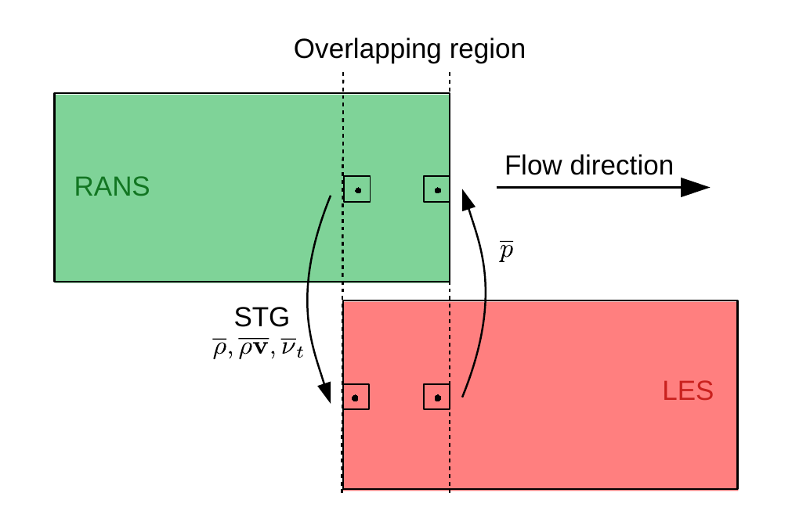
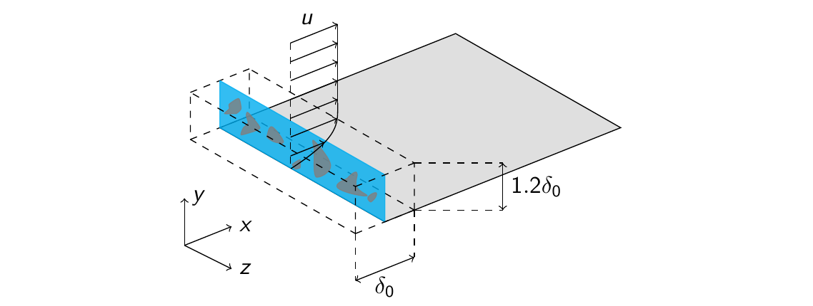
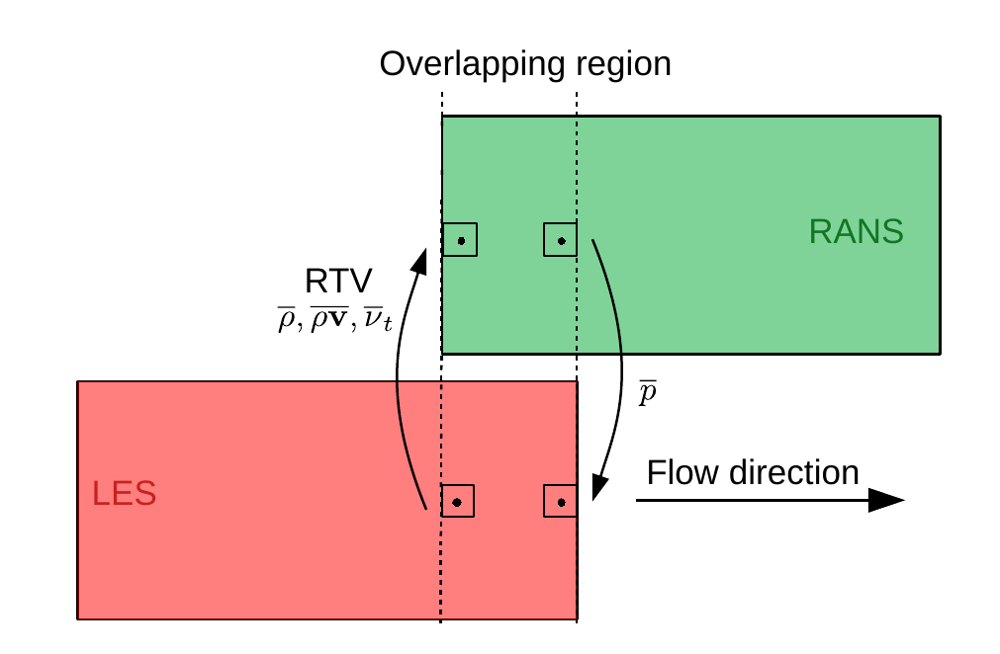

# Zonal RANS/LES method # {#nmZonal}

A promising method to efficiently simulate turbulent flows is the zonal RANS/LES method,
which promises to provide accurate results at reduced computational costs. The computational
efficiency of RANS models is combined by the accuracy of the LES by spatially reducing
the LES domain to regions of interest.

The cell values are exchanged between the RANS regions and LES region using the underlying
Cartesian reference mesh which ensures an efficient exchange without expensive cell value
interpolation even for different grid resolutions of the embedded LES domain and the RANS
domain.

## RANS-to-LES coupling

To couple the embedded LES domain with the upstream RANS domain time averaged values
from the RANS domain are used to generate the turbulent energy spectrum at the LES inflow.
To ensure that information of the LES domain is propagated to the RANS domain located
upstream of the rim seal, the time averaged pressure of the LES domain is set as an
outflow condition of the RANS domain. The time average is calculated by the moving average
defined for a arbitrary variable \f$ \Phi \f$

\begin{equation}
\langle \Phi^t \rangle|_{n+1} = \frac{\Delta t_{exp}}{T_{avg}} \Phi|_{n+1} + (1-\frac{\Delta t_{exp}}{T_{avg}}) \langle \Phi^t \rangle|_{n}
\end{equation}

 { width=40% }

### Synthetic turbulence generation (STG)
The velocity fluctuations at the LES inflow are generated by the reformulated
synthetic turbulence generation~(STGR) method~\cite{Roidl_2015}. This
method is a synthetic eddy method (SEM), which composes a turbulent
velocity field by a superposition of eddies in a virtual volume.

 { width=60% }

The velocity fluctuations at a point \f$ (x, y, z)\f$ in the LES inlet plane are
calculated as a sum over all individual eddy contributions

\begin{equation}
  u'_m(x,y,z,t)
  =
  \sum_{i=1}^N \underbrace{\Theta_m^i f_{l_x,m}(\tilde{x}) f_{l_y,m}(\tilde{y}) f_{l_z,m}(\tilde{z})}_{u_m^i(x,y,z,t)}
\end{equation}
with
\begin{equation}
  \tilde{x} = \frac{x - x^i}{l_x}
   \quad , \quad
  \tilde{y} = \frac{y - y^i}{l_y}
   \quad , \quad
  \tilde{z} = \frac{z - z^i}{l_z}
\end{equation}

and where \f$ l_{x,y,z} \f$ are the turbulent length scales. The Cartesian
direction is denoted by \f$ m=1,2,3 \f$. The influence of a particular eddy
core on a point in the LES inlet plane is calculated using the shape
functions \f$ f_{l_{x,y,z},m} \f$ given by

\f{align}{
  f_{l_x,1}(\tilde{x})f_{ l_y,1}(\tilde{y})f_{l_z,1}(\tilde{z}) &= G(\tilde{x})G(\tilde{y})H(\tilde{z}) ,\\
  f_{l_x,2}(\tilde{x})f_{ l_y,2}(\tilde{y})f_{l_z,2}(\tilde{z}) &= -G(\tilde{x})G(\tilde{y})H(\tilde{z}) ,\\
  f_{l_x,3}(\tilde{x})f_{ l_y,3}(\tilde{y})f_{l_z,3}(\tilde{z}) &= G(\tilde{x})H(\tilde{y})G(\tilde{z}) ,\\
\f}

where
\begin{equation}
H(\tilde{\zeta}) = \frac{1-cos(2\pi \tilde{\zeta})}{2 \pi \cdot 0.44\sqrt{l_{\zeta}}}
\end{equation}
and
\begin{equation}
G(\tilde{\zeta}) = \frac{2}{\sqrt{l_{\zeta} \pi}} e^{-(2\tilde{\zeta})^2}
\end{equation}
with \f$ \tilde{\zeta} = \tilde{x}, \tilde{y}, \tilde{z}\f$.

The instantaneous velocity conponents at the LES inlet plane are
determined by the Cholesky decomposition of the velocity fluctuations
superimposed to the time averaged RANS velocity distribution
\begin{equation}
  u_{LES,m} = u_{RANS,m} + \sum_{n} A_{mn} u'_m(x,y,z,t)
\end{equation}
where \f$ A_{mn} \f$ is the decomposition of the Reynolds-stress tensor
computed from the RANS solution. Thereby, the calculated velocity fluctuations are
scaled such that the root-mean-square (RMS) values at the LES inlet match the RMS
values of the RANS solution. The RMS values of the RANS solution are calculated by
\begin{equation}
  \overline{u'v'} = \nu_t \sqrt{2S_{ij}S_{ij}}
\end{equation}
The values for \f$ \overline{u'u'}\f$, \f$ \overline{v'v'}\f$, \f$ \overline{w'w'}\f$,
\f$ \overline{u'w'}\f$ and \f$ \overline{v'w'}\f$ are calculated from by similarity relations.

Since many of the relevant turbulent scales tend to dissipate in the overlapping region,
the turbulence production in the shear-stress budget has to be adjusted to that of the
RANS solution at the position of the RANS outflow by introducing a volume force in the
momentum equations at defined control planes in the overlapping region. Otherwise, the
turbulent fluctuations in the boundary layer in the embedded LES domain would be smaller
than the fluctuations in the pure LES setup.

This method is based on the control plane formulation of Spille-Kohoff and Kaltenbach
[Spille-Kohoff]. In this, local flow events such as bursts and sweeps are enhanced
or damped based on on the difference of the Reynolds shear stress of the LES solution
and the RANS solution at the RANS outflow, which is described by the error \f$ e \f$

\begin{equation}
  e(y,t) = \langle u'v' \rangle_{RANS} - \langle u'v' \rangle_{LES}^{z,t}
\end{equation}

The current Reynolds shear stress \f$ \langle u'v' \rangle_{LES}^{z,t} \f$ is averaged over time
\f$ t \f$ and the periodic \f$ z\f$-direction. The magnitude of the volume force is
given by

\begin{equation}
  f(x_0,y,z,t) = r(y,t) \left[u(x_0,y,z,t) - \langle u \rangle^{z,t} \right] 
\end{equation}

and

\begin{equation}
  r(y,t) = \alpha e(y,t) + \beta \int_0^t e(y,t')dt'
\end{equation}

The non-dimensional constants are set for subsonic flows to \f$ \alpha=10 \f$ and
\f$ \beta=2 \f$.

## LES-to-RANS coupling

To couple the embedded LES domain with the downstream RANS domain located the turbulent
viscosity, which is needed for the Spalart-Allmaras turbulence model, has to be
reconstructed from the time averaged flow quantities of the LES domain.
The presented method is based on the work of König et al. [König].

Similar to the RANS/LES interface, the time averaged pressure of the downstream
located RANS domain is used as an outflow condition for the embedded LES domain
ensuring an upstream propagation of information. 

 { width=40% }

### Reconstruction of turbulent viscosity (RTV)

The turbulent viscosity \f$ \nu_t \f$ is calculated by

\begin{equation}
  \nu_t = \frac{k}{\omega}
\end{equation}

The turbulent kinetic energy \f$ k = \frac{1}{2} \overline{u'_iu'_i} \f$ is calculated using
the time averaged amd instantaneous flow quantities of the LES domain. The qunatity
\f$ \omega \f$ is approximated using the generalized form of Bradshaw's hypothesis

\begin{equation}
  \omega = \frac{1}{\sqrt{C_{\mu}}} \sqrt{2S_{ij}S_{ij}}
\end{equation}

with \f$ C_{\mu} = 0.09 \f$. The strain rate tensor \f$ S_{ij} \f$

\begin{equation}
  S_{ij} = \frac{1}{2} \left( \frac{\partial \langle u_i \rangle}{\partial x_j} + \frac{\partial \langle u_j \rangle}{\partial x_i} \right)
\end{equation}