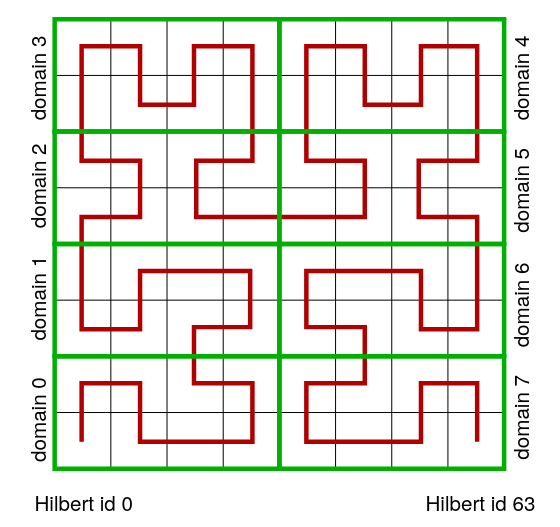
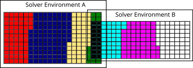

# Parallelization # {#nmParallelization}

[TOC]

In the following sections the paralleliztion strategies of m-AIA
are explained. At first, the grid partitioning including the Hilbert
curve and the partition level shift is described. Then, the multi-solver
environments, i.e., the breakdown of the whole grid in solver specific
grid parts, is outlined. The section closes with discussion of 
shared and non-shared memory parallelization.

## Grid Partitioning # {#nmParallelizationGP}
To efficiently parallelize a simulation, the computational mesh must be
distributed among the MPI ranks. Hence, every MPI rank owns only a portion
of the total number of cells. To obtain a good load balancing between the
MPI ranks, the cells must be equally distributed between the ranks. The
communication between the ranks is done by window and halo cells as described
in [Window/Halo](@ref #nmParallelizationHalo). The distribution of the
cells is done based on the Hilbert curve. In case of massive local grid
refinement, a partiion level shift is used to yield a good load balancing.

### Hilbert Curve # {#nmParallelizationGPHC}
The Hilbert curve is a continuous fractal space-filling curve developed by the German
mathematican David Hilbert. It fills a quadratic area or a cubic volume using piecewise
linear curves. Hence, the centers of all cells of a computational mesh can be connected
by a discrete hilbert curve, where the length of the piecewise linear curves equals the cell
length on the `minLevel` also referred to as the partition level. Thereby, each partition
cell is assigned an id called Hilbert
id. Based on this id, the partition cells are ordered and distributed to the MPI ranks as shown
in the figure below. Of course, the child cells of the a partition cell are assigned to the same
MPI rank. Since a compuational mesh does not necessarily have a quadratic or cubic shape, the
area/volume filled by the Hilbert curve is defined by the maximum length of the domain.
Therefore, the numbering of the cells by the Hilbert curve is not continuous. It contains
gaps, where the Hilbert curve leaves the area/volume of the computational mesh.However,
the gap in the Hilbert id does not influence the ordering of the cells. It only 
results in the fact, that the Hilbert id equals the global id of a cell only for
quadratic/cubic meshes without refinement.

One advantage of using the Hilbert curve for ordering cells is that it preserves locality
fairly well. That is, neighboring cells in a volume \f$ V \f$ will be assigned Hilbert ids
close to each other. This minmizes the length of the domain boundary between two MPI ranks.
Thus, it minimizes the communication effort of a simulation. A disadvantage is, that the
ordering does not considers load differences between cells. If a partition cell has many levels
of refinement, the number of leave cells, on which the computation is performed is much higher.
Hence, the work load of this cell is high than the work load of a partition cell having only
few refinement levels. This can be avoided by weighting the cells, by using dynamic load
balancing [DLB](@ref #), or by a partition level shift [Lintermann2014]

### Partition level shift # {#nmParallelizationGPPLS}
The partition level shift is used to distribute cells to different ranks if a mesh contains
areas of very fine refinement, i.e., the difference between the maximum refinement level and
the partition level is large. In this case, the partition level is increased. Thereby, the number
of possible child cells is decreased and the work load of the cells is aligned.

## Multi-Solver environments # {#nmParallelizationMSE}

As a result of the utilized parallelization procedure, not all solver environements need to compute the data for the full grid. Therefore, a single solver environment only contains the cells which are associated with the respective solver as determined by the hilbert curve. For simulations with a single solver, i.e., one FVMB environment, the full domain is split between all available ranks. For multi-solver environments, i.e., coupled environments as, e.g., LB-LPT, ranks are split into distinct groups with each associated to a solver environment. As exemplarily shown in Fig., two solver environments have, as shown by the black surrounding boxes, their own domain box in which the cell ids are referred to by their global id. In contrast, each solver has only the cells that are located in their own domain setup as marked by the different colors. These cells are refered to by their local cell id inside the solver.

Overlapping cells, as marked by the black cells in Fig., are cells shared by multiple solvers and multiple environments and can be connected by the grid id. That is, the id connected to the hilbert id as generated by the grid generator.
For ranks, which are not part of the actual solver environment, no internal cells are available and the rank is marked as *inactive* for this solver environment. It is, of course, active for a different solver.

As a result, each cell has three different ids:
 <ol>
  <li>**Grid id** - cell id on the common grid as computed by the grid generator and the hilbert curve</li>
  <li>**Global id** - cell id on the common grid of a single solver environment</li>
  <li>**Local id** - cell id on the grid of a single rank</li>
</ol>

With this approach, multiple advantages can be derived.

First, each cell can be translated into each other. This allows the efficient in-memory transfer of variables for overlapping cells between multi-solver environments (ref coupling) due to an inter-environment mapping through the common grid. Since cells are adapted in a single solver environment (ref adaptation), mappings for cells of differing refinement levels can be found by common parent/root cells.

Furthermore, the exchange on window/halo interfaces is simplified by sorting and exchanging for the global id, i.e., the common id within a solver environment. With this, cells can be easily connected through different ranks and cross-referenced. Since the global id is connected to the hilbert id, each rank has a global domain offsets array which allows for the fast determination of a containing rank given a global cell id.

## Backend

### Shared memory parallelization # {#nmParallelizationBS}

### Non-shared memory parallelization # {#nmParallelizationBNS}

#### Halo/Window connections # {#nmParallelizationHalo}

## References

* A. Lintermann, S. Schlimpert, J.H. Grimmen, C. Gnther, M. Meinke, W. Schröder,
  Massively parallel grid generation on HPC systems, Computer Methods in Applied Mechanics
  and Engineering 277.1, 2014, 131-153, [10.1016/j.cma.2014.04.009][Lintermann2014].

[Lintermann2014]: https://doi.org/10.1016/j.cma.2014.04.009
