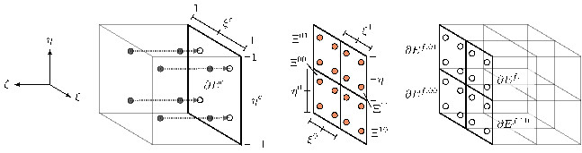

# Discontinuous Galerkin (DG) # {#nmDG}

Source: [Schlottke-Lakemper2019][Schlottke-Lakemper2019]

The discontinuous Galerkin spectral element method (DGSEM) has advantageous properties for problems
dominated by wave propagation, in particular the support for high order of accuracy while
maintaining a compact numerical stencil.  In the following, the general DGSEM is first briefly
introduced for cube-shaped elements.  Then, the application of the DGSEM to non-conforming meshes,
which occur in hierarchical Cartesian grids, is shown in (@ref nmDGMortarMethod).  A more
detailed derivation of the DGSEM in two dimensions is available, e.g., in
[Schlottke-Lakemper2017][Schlottke-Lakemper2017].

## Derivation for cube-shaped elements # {#nmDGDerivation}

A general system of hyperbolic conservation equations reads
\f{equation}{
  \mv{U}_t + \mv{\nabla} \cdot \mv{f}(\mv{U}) - \mv{S}(\mv{U}) = 0,\qquad\forall \mv{x} \in \Omega.\label{eqn:conservation_equation}
\f}
\f$\mv{U}\f$ is the vector of state quantities, \f$\mv{f}\f$ represents the flux terms, and
\f$\mv{S}\f$ denotes the source vector.  The computational domain \f$\Omega\f$ is subdivided into
elements, which for hierarchical Cartesian grids are cubes.  In each element, the differential
equation is mapped to the reference element \f$E = [-1,1]^3\f$ for improved efficiency. The
transformed system reads
\begin{equation}
  J\mv{U}_t + \mv{\nabla}_{\mv{\xi}} \cdot \mv{f} - J\mv{S} = 0,\label{eqn:dg_transformed}
\end{equation}
with the divergence operator in reference coordinates \f$\mv{\nabla}_{\mv{\xi}} = (\partial/\partial
\xi, \partial/\partial \eta, \partial/\partial \zeta)^\top\f$. The pseudo-Jacobian determinant is
given as \f$J = h/2\f$, where \f$h\f$ is the element edge length in physical coordinates.

Next, the differential equation is rewritten in its weak form. \f$\eqref{eqn:dg_transformed}\f$
is multiplied by a test function \f$\phi = \phi(\mv{\xi})\f$ and integrated over the reference
element \f$E\f$. Using integration by parts, the weak formulation reads
\f{equation}{
  \int\limits_E J\mv{U}_t\phi \,d\mv{\xi} + \int\limits_{\partial E} (\mv{f} \cdot \mv{n})^* \phi\,d{\mv{s}} - \int\limits_E \mv{f} \cdot \mv{\nabla_\xi} \phi \,d\mv{\xi} - \int\limits_E J\mv{S}\phi \,d\mv{\xi} = 0,\label{eqn:dg_weak}
\f}
where \f$\mv{n}\f$ is the outward facing surface normal vector in the reference system and
\f$d{\mv{s}}\f$ is the surface differential on the element boundary \f$\partial E\f$. Since the
solutions from adjacent elements are discontinuous at the interface, the normal flux \f$\mv{f} \cdot
\mv{n}\f$ on \f$\partial E\f$ is not uniquely defined, as indicated by the superscript \f$(\cdot)^*\f$. To
obtain a single flux value at element interfaces, e.g. the local Lax-Friedrichs flux
formulation can be used.

Inside each element, the solution \f$\mv{U}\f$ is approximated by a polynomial tensor product ansatz
with degree \f$N\f$ in each spatial direction
\begin{equation}
  \mv{U}(\mv{\xi}, t) \approx \mv{U}_h(\mv{\xi}, t) = \sum_{i,j,k=0}^N \mv{\hat{U}}_{ijk}(t) \psi_{ijk}(\mv{\xi}).\label{eqn:approx_u}
\end{equation}
The nodal coefficients \f$\mv{\hat{U}}_{ijk}(t)\f$ are the degrees of freedom that represent the
time-dependent solution state, while the basis functions \f$\psi_{ijk} \in [-1, 1]^3\f$ are the products
of one-dimensional Lagrange polynomials and are defined by
\begin{equation}
  \psi_{ijk}(\mv{\xi}) = l_i(\xi) l_j(\eta) l_k(\zeta).\label{eqn:dg_basis_function}
\end{equation}
The Lagrange basis functions \f$l_i(\xi)\f$ of degree \f$N\f$ are defined on the reference interval \f$\xi \in
[-1, 1]\f$ by a set of interpolation points \f$\{\xi_i\}_{i=0}^N\f$, which are the
Legendre-Gauss nodes. They have the Lagrange property \f$l_i(\xi_j) = \delta_{ij}\f$. The fluxes inside
the elements and the source terms are approximated analogously by polynomials defined on the same
set of interpolation points.

Following the Galerkin ansatz, the test function \f$\phi\f$ in Eq. \f$\eqref{eqn:dg_weak}\f$ is selected from the
same function space as the polynomial basis \f$\phi \in \mathcal{P}_N(E)\f$, i.e., the vector space of
polynomials up to degree \f$N\f$ that are defined on the reference element. Choosing \f$\phi = \psi_{ijk}\f$
for \f$i,j,k = 0,\ldots,N\f$ to obtain \f$(N + 1)^3\f$ test functions and further replacing the solution,
the fluxes and the source term by their approximations, \f$\eqref{eqn:dg_weak}\f$ becomes
\begin{equation}
  \int\limits_E J\mv{U}_{h,t}\psi_{ijk} \,d\mv{\xi} + \int\limits_{\partial E} (\mv{f} \cdot \mv{n})^* \psi_{ijk}\,d \mv{s} - \int\limits_E \mv{f}_h \cdot \mv{\nabla_\xi} \psi_{ijk} \,d\mv{\xi} - \int\limits_E J\mv{S}_{h}\psi_{ijk} \,d\mv{\xi} = 0,\qquad i,j,k=0,\ldots,N.\label{eqn:dg_weak_discretized}
\end{equation}
To numerically evaluate the integrals, Gauss quadrature rules are used.
Integration and interpolation are collocated, i.e., the same Legendre-Gauss nodes are used for the
integration as well as for the discretization of the solution and the fluxes.

\f$\eqref{eqn:dg_weak_discretized}\f$ yields one equation per unknown degree of freedom. Inserting the
definitions for the approximation of the solution, the fluxes, and the source terms, the
semi-discrete DG operator \f$\mathcal{L}(\mv{U}, t) = \mv{U}_t\f$ is obtained. To advance the
solution to the next time step, \f$\mathcal{L}\f$ is integrated in time by a low-storage
implementation of an explicit five-stage fourth-order Runge-Kutta scheme, which allows large time
steps for wave propagation problems.  The time step \f$\Delta t = \text{CFL}/(2N + 1) \cdot
h/\Lambda_\text{max}\f$ depends on the Courant-Friedrichs-Lewy (CFL) condition and for, e.g. the the
acoustic perturbation equations the maximum wave propagation speed \f$\Lambda_\text{max} =
\max(|\bar{u}|, |\bar{v}|, |\bar{w}|) + c_0\f$.}

## Extension to non-conforming meshes # {#nmDGMortarMethod}

To support non-conforming elements, i.e., interfaces where a coarse element is adjacent to multiple
refined cells, the mortar element method is employed.  In the scheme, conformity is restored by
adding an intermediate interface between non-conforming cells. Solution data from neighboring
element faces is projected to the mortar, where unique surface flux values are computed. Afterwards,
the fluxes are projected back to the individual elements.

Since the refinement level difference between neighboring cells
in the Cartesian grid is limited to one
the non-conforming case is restricted to interfaces with one element on one and four
elements on the other side, such as shown in the figure below.

Without loss of generality for such meshes, the following discussion will be limited to a
single coarse element \f$E^c\f$ on the left side and four refined elements \f$E^{f,st}\f$ with \f$s, t = 0, 1\f$
on the right side of the non-conforming interface. Four mortars \f$\Xi^{st}\f$ are defined,
which coincide with the corresponding faces \f$\partial E^{f,st}\f$ of the refined elements.
The superscripts \f$(\cdot)^s\f$ and \f$(\cdot)^t\f$ specify the relative position in the
\f$\xi/\eta\f$-direction. A value of \f$0/1\f$ indicates the entity located towards the negative/positive
coordinate direction. On the element faces and on the mortar elements, the solution states and
fluxes are approximated by polynomials of degree \f$N\f$ in each spatial direction.  The same nodal
basis functions \f$\psi_{ij} = l_i l_j\f$ with \f$i,j = 0,\ldots,N\f$ as in (@ref nmDGDerivation) are
used. They are defined on the reference interval \f$[-1, 1]^2\f$ by the set of Legendre-Gauss nodes
\f$\{\mv{\xi}_{ij}\}_{i,j=0}^N\f$ using the face-local coordinate systems \f$\mv{\xi}^c = (\xi^c,
\eta^c)\f$ and \f$\mv{\xi}^{st} = (\xi^s, \eta^t)\f$.

In the forward projection step, the solutions on the coarse element face \f$\mv{U}^c_h(\mv{\xi}^c)\f$
and on the fine element faces \f$\mv{U}^{f,st}_{h}(\mv{\xi}^{st})\f$ are projected to the mortars by
using \f$L^2\f$ projection. For the coarse element, the four projections are given by
\begin{equation}
  \int\limits_{-1}^1\int\limits_{-1}^1\left(\mv{U}^{\Xi,c,st}_h - \mv{U}^c_h\right)\phi\,d
  \xi^s d \eta^t = 0,\qquad s,t = 0,1,\label{eqn:forward_proj}
\end{equation}
where \f$\mv{U}^{\Xi,c,st}_h(\mv{\xi}^{st})\f$ are the sought solution states on the mortars. As in
the previous section, the test function \f$\phi\f$ is replaced by the \f$(N+1)^2\f$ Lagrange basis functions
\f$\psi_{ij}\f$ and interpolation is substituted by Gauss quadrature. After simplifying
\eqnref{forward_proj}, the projections read
\begin{equation}\label{eqn:forward_proj_tensor}
  \mv{\hat{U}}^{\Xi,c,st}_{ij} = \sum_{l,m=0}^N \mv{\hat{U}}^c_{lm}
  l_l\left(\frac{1}{2}(\xi^s_i  \pm 1)\right)
  l_m\left(\frac{1}{2}(\eta^t_j \pm 1)\right),\qquad
  \begin{aligned}
    i,j &= 0,\ldots,N,\\
    s,t &=0,1,
  \end{aligned}
\end{equation}
where the hat \f$\hat{(\cdot)}\f$ again denotes the coefficients for the nodal basis functions.  The
minus sign corresponds to \f$s = 0\f$ or \f$t = 0\f$, while the plus sign corresponds to \f$s = 1\f$ or \f$t = 1\f$.
Since the mortars coincide with the fine element faces, the solution states on the right side of the
mortars are equal to those on the fine element faces, i.e.,
\f$\mv{\hat{U}}^{\Xi,f,st}_{ij} = \mv{\hat{U}}^{f,st}_{ij}\f$.

After obtaining the solutions on the mortar elements, the normal flux is calculated at the
Gauss nodes using the numerical flux formulation introduced in (@ref nmDGDerivation). The mortar
fluxes \f$\mv{f}^{*,\Xi,st}_h(\mv{\xi}^{st})\f$ are then projected back onto the element faces using
\f$L^2\f$ projection. For the coarse element, the projection is given by
\f{align}{
  &\phantom{+}\int\limits_{-1}^0\int\limits_{-1}^0 \left(\mv{f}^{*,c}_h - \mv{f}^{*,\Xi,00}_h\right) \phi \,d\xi^c d\eta^c + 
   \int\limits_{ 0}^1\int\limits_{-1}^0 \left(\mv{f}^{*,c}_h - \mv{f}^{*,\Xi,01}_h\right) \phi \,d\xi^c d\eta^c \nonumber \\
  &+\int\limits_{-1}^0\int\limits_{ 0}^1 \left(\mv{f}^{*,c}_h - \mv{f}^{*,\Xi,10}_h\right) \phi \,d\xi^c d\eta^c + 
   \int\limits_{ 0}^1\int\limits_{ 0}^1 \left(\mv{f}^{*,c}_h - \mv{f}^{*,\Xi,11}_h\right) \phi \,d\xi^c d\eta^c = 0,
\label{eqn:reverse_proj}
\f}
where \f$\mv{f}^{*,c}_h(\mv{\xi}^c)\f$ is the flux on the coarse element face. Following the same
procedure as before, \f$\eqref{eqn:reverse_proj}\f$ is simplified to
\begin{equation}
  \mv{\hat{f}}^{*,c}_{ij} = \sum_{s,t=0}^1\sum_{p,q=0}^N \mv{\hat{f}}^{*,\Xi,st}_{pq}
  \frac{1}{2}l_i\left(\frac{1}{2}(\xi^s_p  \pm 1)\right)\frac{\omega_p}{\omega_i}
  \frac{1}{2}l_j\left(\frac{1}{2}(\eta^t_q \pm 1)\right)\frac{\omega_q}{\omega_j}, \qquad i,j=0,\ldots,N,\label{eqn:reverse_proj_tensor}
\end{equation}
where \f$\omega_i\f$ are the \f$N+1\f$ integration weights for Legendre-Gauss quadrature. For the refined
elements, the reverse projection operator is again just the identity, i.e.,
\f$\mv{\hat{f}}^{*,f,st}_{ij} =
\mv{\hat{f}}^{*,\Xi,st}_{ij}\f$.

## References

* M. Schlottke-Lakemper, A. Niemoeller, M. Meinke, W. Schroeder,
Efficient parallelization for volume-coupled multiphysics simulations on hierarchical Cartesian grids, Computer Methods in Applied Mechanics and Engineering, Volume 352, pp 461-487, 2019, [10.1016/j.cma.2019.04.032][Schlottke-Lakemper2019].
[Schlottke-Lakemper2019]: https://doi.org/10.1016/j.cma.2019.04.032

* M. Schlottke-Lakemper, H. Yu, Sven Berger, M. Meinke, W. Schroeder, A fully coupled hybrid computational aeroacoustics method
on hierarchical Cartesian meshes, Comput. Fluids 144 (2017) 137–153, [10.1016/j.compfluid.2016.12.001][Schlottke-Lakemper2017].
[Schlottke-Lakemper2017]: http://dx.doi.org/10.1016/j.compfluid.2016.12.001
