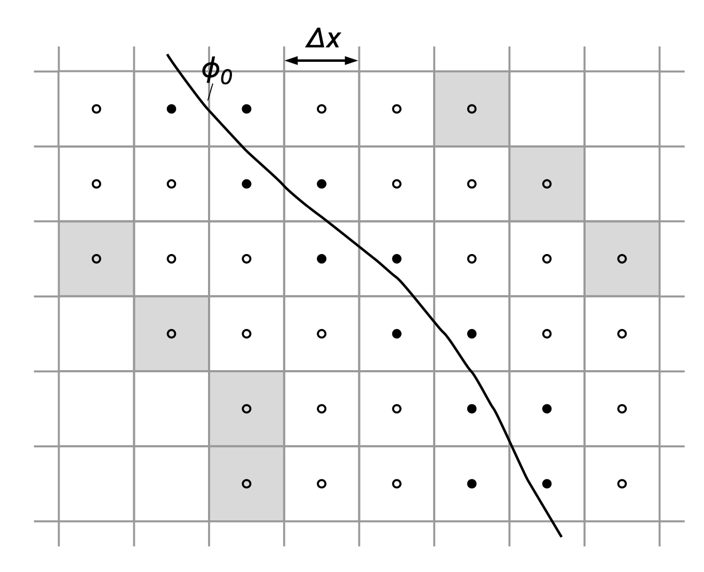

# Level Set (LS) # {#nmLS}

The numerical solution scheme of the level set equation is very dependant of the 
application. First the different time stepping schemes are presented, followed by 
a description of further level set related algorithms.

## Translational Motion Function
For the translational motion of solid interfaces a semi-Lagrange solver [[guenther2014]] 
can be used to determine the level-set function. 
In this approach, the error of the geometric representation of the surface is 
reduced to the constant interpolation error between two reference locations.

## Rotational Motion Function

## Arbitrary Motion Function

## Initialisation of Level Set Field
The signed distance field data is initialized as initial condition from a reference STL file. 

## Band Cell Approach
As pointed out, the interface is commonly represented by the zero level set \f$\varphi_0\f$ bounding a region \f$\Omega^{+} \subset R^n\f$ and separating \f$\Omega^{-} \subset R^n\f$ from \f$\Omega^{+}\f$. It is embedded in the \f$n\f$-dimensional scalar level-set function \f$\varphi=\varphi(\mathbf{x}, t)\f$  

Let the subset Γ of cells which are adjacent to the zero level set be defined by 

\f{align}{
\Gamma=\left\{C_{i, j, k}:\left(\Pi_{i^{\prime}, j, k}^{i, j, k} \varphi \leq 0\right) \vee\left(\Pi_{i, j^{\prime}, k}^{i, j, k} \varphi \leq 0\right) \vee\left(\Pi_{i, j, k^{\prime}}^{i, j k} \varphi \leq 0\right)\right\}
\f}

That is, all cells in Γ are located within a distance \f$\Delta X\f$ from the zero level set.

The computational costs of solving the level-set equation can be reduced by orders of magnitude when the level-set method is localized, i.e., a solution is sought only in a small region around the zero level set, while all other areas are assigned a constant value indicating the location in \f$\Omega^{+}\f$ or \f$\Omega^{-}\f$. We consider a localized computational domain \f$\Omega_\varphi \subset \Omega\f$ moving along with the zero level set. All cells outside \f$\Omega_\varphi\f$ are discarded and the level-set algorithms are localized as proposed in , such that the computational costs of the overall level-set method scale with \f$\mathcal{O}(\mathcal{N})\f$. Let \f$\mathcal{B}\f$ designate the subset of cells \f$C_{i, j, k}\f$ which are used in the localized solution the level-set equation forming a narrow band around \f$\varphi_0\f$ bounded by the boundary cells \f$\hat{C}_{i, j, k} \in \partial \mathcal{B}\f$. Let us furthermore define \f$\partial \mathcal{B} \cap \Omega_\varphi=\emptyset\f$ such that boundary cells are outside of and adjacent to \f$\Omega_\varphi\f$. \f$\mathcal{B}\f$ is created using an efficient marching algorithm, which is based on neighbor relations. The level-set solver is based on a hierarchical quadtree/octree data structure, such that all neighbor information can be directly accessed. The narrow band \f$\mathcal{B}\f$ is regenerated before each reinitialization step, while the subset \f$\Gamma\f$ is updated after each time step.

{ width=50% }

### Time and spatial discretization

The level-set equation is integrated in time with a 3-step third-order accurate TVD Runge-Kutta scheme [[Shu]] denoted by \f$\mathrm{RK}_3\f$,
\f{align}{
\left\{\begin{array}{l}
\varphi^{(0)}=\varphi^w \\
\varphi^{(k)}=\alpha_k \varphi^{(0)}+\beta_k \varphi^{(k-1)}-\gamma_k \Delta t L\left(\varphi^{(k-1)}\right) \\
\varphi^{w+1}=\varphi^{(N)}
\end{array}\right.
\f}

where \f$N=3\f$ and the coefficients \f$\boldsymbol{\alpha}=\left(0, \frac{3}{4}, \frac{1}{3}\right), \boldsymbol{\beta}=\left(1, \frac{1}{4}, \frac{2}{3}\right)\f$, and \f$\boldsymbol{\gamma}=\left(1, \frac{1}{4}, \frac{2}{3}\right)\f$ are used. The superscript \f$k\f$ denotes the Runge-Kutta step, while the superscript \f$w\f$ counts the time steps \f$\Delta t\f$. The operator \f$L(\varphi)\f$ denotes the numerical approximation of the term \f$v_{\Gamma} \cdot \boldsymbol{\nabla} \varphi\f$ in the level-set equation, which is specified in the following. To spatially discretize the level-set equation, unlimited third- and fifth-order upstream central schemes denoted by \f$\mathrm{UC}_3\f$ and \f$\mathrm{UC}_5\f$ are used, respectively. The upwind-biased spatial derivatives read as follows:

\f{align}{
{UC}_3 : \left\{\begin{array}{l}
D_{i, j, k}^{x, L}=\frac{1}{6 \Delta x}\left(\varphi_{i-2, j, k}-6 \varphi_{i-1, j, k}+3 \varphi_{i, j, k}+2 \varphi_{i+1, j, k}\right) \\
D_{i, j, k}^{x, R}=\frac{1}{6 \Delta x}\left(-\varphi_{i+2, j, k}+6 \varphi_{i+1, j, k}-3 \varphi_{i, j, k}-2 \varphi_{i-1, j, k}\right)
\end{array}\right.
\f}

\f{align}{
{UC}_5 : \left\{\begin{array}{c}
D_{i, j, k}^{x, L}=\frac{1}{60 \Delta x}\left(-2 \varphi_{i-3, j, k}+15 \varphi_{i-2, j, k}-60 \varphi_{i-1, j, k}+20 \varphi_{i, j, k}+30 \varphi_{i+1, j, k}-3 \varphi_{i+2, j, k}\right) \\
D_{i, j, k}^{x, R}=\frac{1}{60 \Delta x}\left(2 \varphi_{i+3, j, k}-15 \varphi_{i+2, j, k}+60 \varphi_{i+1, j, k}-20 \varphi_{i, j, k}-30 \varphi_{i-1, j, k}+3 \varphi_{i-2, j, k}\right)
\end{array}\right.
\f}

Likewise derivatives with respect to the \f$y\f$ and \f$z\f$ direction are obtained by exchanging the respective subscripts. Let us define \f$D_{i, j, k}^{x, \pm} \equiv D_{i, j, k}^{x, L} \pm D_{i, j, k}^{x, R}\f$ 
and introduce the vector operator \f$\mathfrak{D}_{i, j, k}^{\pm}=\left(D_{i, j, k}^{x, \pm}, D_{i, j, k}^{y, \pm}, D_{i, j, k}^{z, \pm}\right)^T\f$. Then, \f$L(\varphi)\f$ can be computed by
\f{align}{
L\left(\varphi_{i, j, k}\right)=\frac{1}{2}\left\{\left(\sum_\zeta\left|f_\zeta\right| \mathbf{e}_\zeta\right) \cdot \mathfrak{D}_{i, j, k}^{+}+v_{\Gamma} \cdot \mathfrak{D}_{i, j, k}^{-}\right\}, \zeta=\{x, y, z\}
\f}

[Shu]:https://doi.org/10.1016/0021-9991(88)90177-5

### Specification of the extension velocity
The motion of the zero level set \f$\varphi_0\f$ is governed by the extension velocity \f$v_{\Gamma}=v_{\Gamma}(\mathbf{x}, t)\f$,

\f{align}{
v_{\Gamma}=\mathbf{v}+s \mathbf{n},
\f}

with the components \f$v_{\Gamma}=\left(f_x, f_y, f_z\right)^T\f$. It comprises the advection by an underlying flow velocity field \f$\mathbf{v}=\mathbf{v}(\mathbf{x}, t)\f$ and the propagation of the front
relative to the flow field in the normal direction to \f$\varphi_0\f$ by \f$s\f$. The normal direction is defined by the outward normal vector

\f{align}{
\mathbf{n}=-\frac{\boldsymbol{\nabla} \varphi}{|\boldsymbol{\nabla} \varphi|}
\f}

pointing into \f$\Omega^{-}\f$, where \f$\boldsymbol{\nabla}=\left(\partial_x, \partial_y, \partial_z\right)^T\f$ denotes the vector operator of spatial derivatives. The local speed of propagation $s$ may be induced by several 
effects such as curvature and, in the case of premixed, level-set based combustion, the flame propagation into the unburnt gas. For geometric motion, the movement function of the boundary surface would also appear as a part of the translational term as a function of time.

The extension velocity vector \f$v_{\Gamma}\f$ is often only defined at the interface \f$\varphi_0\f$. Furthermore, one would like to move the entire level-set field along with the zero level set rather than move each 
level set individually according to the local velocity. It is therefore useful to compute \f$v_{\Gamma}\f$ or alternatively \f$f_n\f$ 
only on the cells in \f$\Gamma\f$ and then propagate this information along the normal direction to the interface. The first-order partial differential equation

\f{align}{
\partial_\tau f+S(\varphi) \frac{\nabla \varphi}{|\nabla \varphi|} \cdot \nabla f=0
\f}

is formulated in artificial time \f$\tau\f$ for a generic quantity \f$f\f$, which is to be propagated from the interface. The given is a hyperbolic equation of Hamilton-Jacobi type.
That is, the characteristics flow away from the zero level set along the normal vectors \f$\mathbf{n}\f$ and \f$\mathbf{-n}\f$.

## Multiple Level Set Approach
Let \f$\Gamma(t)\f$ be the boundary of the fluid domain \f$\Omega(t)\f$, 
which is composed of a set of \f$N\f$ surface elements \f$\Gamma_i(t)\f$. 
Each element represents various parts of the geometry, 
e.g., individual STL files. Each surface element can be expressed as the zero contour of the 
signed-distance function \f$\varphi_{i+1}(\mathbf{x},t)\f$, which 
may evolve in time by individual motion functions.
The overall surface \f$\Gamma(t)\f$ is constructed from all 
surfaces \f$\Gamma_i(t)\f$ using a combined level set 
\f$\varphi_0(\mathbf{x},t)\f$ as described in [[guenther2014]]. 
Where \f$\varphi_0(\mathbf{x},t)\f$ is constructed as:
\f{align}{

\f}
In this approach, the distance from each surface can be easily evaluated by the
absolute value of the level set value \f$\varphi_i(\mathbf{x},t)\f$.
Thus, the the gap width between interfaces approaching 

This approach can be used to determine 

each other, i.e., when the engine valves are close to the liner valve seat.
When the gap width is smaller than a specified threshold, the combined
\f$\varphi_0(\mathbf{x},t)\f$ level-set field in the vicinity of the gap 
is modified to an artificially closed gap [[guenther2014]]. 
Since only the combined level-set is changed, no surface location
information is lost through this modification.

## Gap Closing

