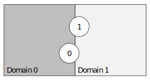
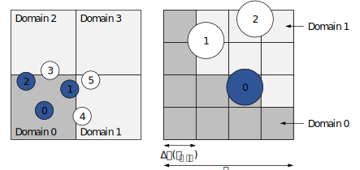
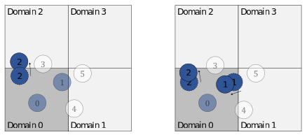

# Rigid bodies (RB) # {#nmRB}

[TOC]

## Integration scheme

The motion equations for the rigid bodies are integrated using a **predictor-corrector** scheme.

For the translation of the center-of-mass the predictor step reads

\f{align}{
\begin{split}
  \tilde{\mv{a}}^{t} &= \mv{a}^{t-1}, \\
  \tilde{\mv{u}}^{t} &= \mv{u}^{t-1} + \frac12 \Delta t (\tilde{\mv{a}}^{t} + \mv{a}^{t-1}), \\
  \tilde{\mv{x}}^{t} &= \mv{x}^{t-1} + \Delta t \mv{u}^{t-1} + \frac14 \Delta t (\tilde{\mv{a}}^{t} + \mv{a}^{t-1}).
\end{split}
\label{eq:rb_trans_pred}
\f}

The obtained information (\f$\tilde{\mv{a}}^{t}, \tilde{\mv{v}}^{t}, \tilde{\mv{x}}^{t}\f$) is then used to:

1. Construct the body surfaces 
2. Impose the boundary conditions on the corresponding flow solver
3. Obtain the external forces \f$\mv{F}^{t}\f$

The corrector step is given by

\f{align}{
\begin{split}
  \mv{a}^{t} &= \frac{\mv{F}^{t}}{m} + \mv{g}(1-\frac{1}{\rho_B / \rho_F}), \\
  \mv{u}^{t} &= \mv{u}^{t-1} + \frac12 \Delta t (\tilde{\mv{a}}^{t} + \mv{a}^{t-1}), \\
  \mv{x}^{t} &= \mv{x}^{t-1} + \Delta t \mv{u}^{t-1} + \frac14 \Delta t (\tilde{\mv{a}}^{t} + \mv{a}^{t-1}).
\end{split}
\label{eq:rb_trans_corr}
\f}

For the rotational part, please be referred to [Seelen2016]

[Seelen2016]: https://doi.org/10.1007/S00707-016-1670-X

## Parallelization

The parallelization algorithm for the rigid bodies solver is based on the space filling curve approach chosen for the hierarchical Cartesian grid. 

### Nomenclature

For a given domain, there are three types of bodies:

**Local bodies** These bodies are local to the current domain, where **all** data describing these bodies is stored.
The current domain is their **home domain**.
The integration of the motion equation is only performed for local bodies. A body is local to a domain, if the center-of-mass is located inside the domain, i.e. is contained by one of its partition cells (see \ref nmParallelization).

**Remote bodies** These bodies are local to another domain, but their domain of influence intersects with the current domain.
The current domain is (one of) their **remote domains**.
Remote bodies are integrated on their respective home domain and all relevant data is communicated to their remote domains.
In turn, remote bodies can still have external forces acting on them from the current domain, which have to be communicated back to the home domain.

Example: Body 0 is local to domain 0, body 1 is local to domain 1. Body 1 is a remote body to domain 0 and, in turn, domain 0 is a remote domain of body 1. The same goes for body 0 and domain 1 (see figure above).

**Periodic dummy bodies** If a domain has a periodic connection with itself, there might be bodies which are local and remote to this domain at the same time, thus have to exist as two individual entities in the data structure. The remote version of this body is called **periodic dummy body**.

### Data structures

There are two major types of data structures in this solver:

**Body collector**: This collector, holds all body data in a specific order:
1. Local bodies
2. Remote bodies
3. Periodic dummy bodies

**Connectivity mappings**: There are two mappings for the communication of body data:
1. Home domain -> Remote bodies
2. Remote domain -> Local bodies

### Algorithm

Initially, each domain determines its local and remote bodies.

In the figure above the procedure using the partitioned Cartesian grid is shown: Bodies are local as long as their center-of-mass is __contained__ by a partition cell of a given domain. Local bodies become relevant to another domain as soon as their domain of influence __intersects__ the partition level halo cells associated to the other domain; This body is a remote body to this domain. 

During the simulation, bodies change their position and therefore their association with specific domains.

