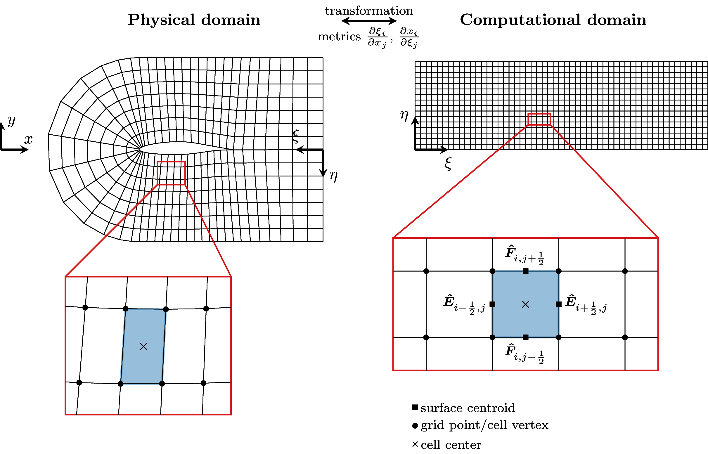
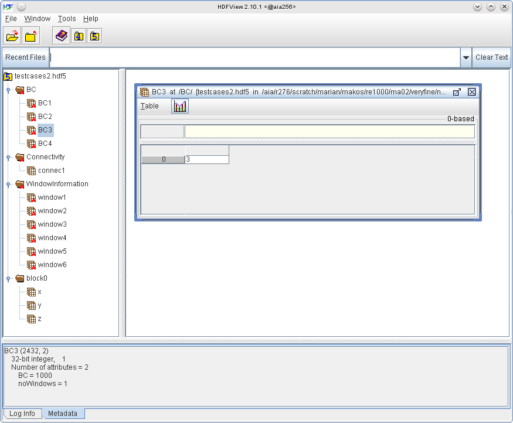
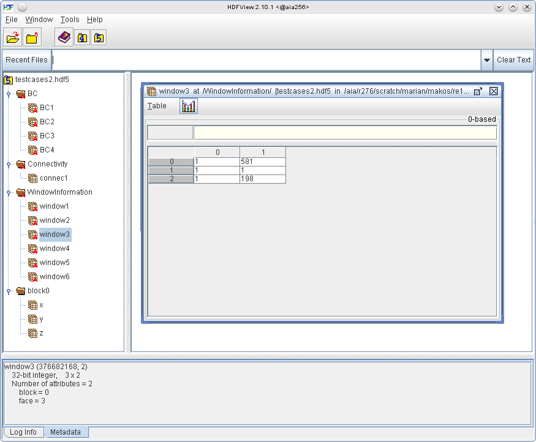
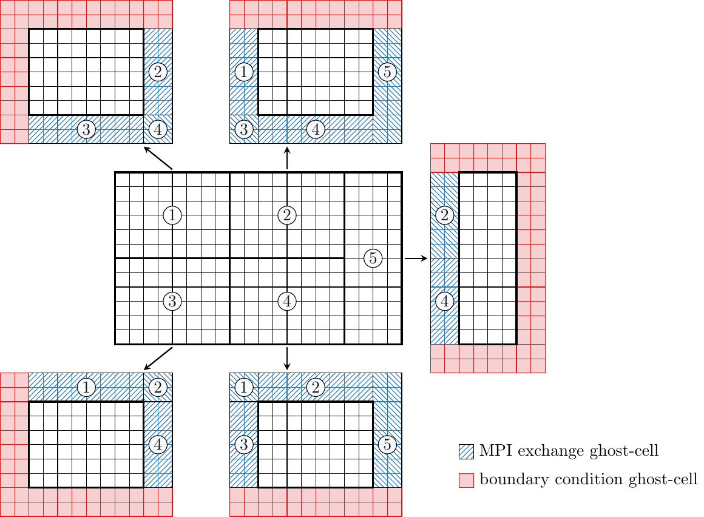

# Structured grid # {#nmStructuredGrid}

[TOC]

In addition to the Cartesian grid solvers m-AIA also provides a [finite volume solver for curvilinear body-fitted structured meshes](@ref nmFVSTRUCTURED) . To use this solver a structured grid must be provided externally, i.e., the meshing must to be done with external tools, e.g., Pointwise for complex grids or Python/Matlab for parameterizable grids. Grids for complex geometries are possible via multi-block grids, the solver also supports grids with singularities.

## General grid description

A structured grid is characterized by a simple access to the grid nodes via \f$(i,j,k)\f$ indexing, where \f$ i \f$, \f$ j \f$, and \f$ k \f$ are the coordinates in the computational coordinate system. The point index can be computed by

\f{align}{
index(i,j,k) = i + (j + k\cdot n_j)\cdot n_i
\f}

where \f$n_i\f$ and \f$n_j\f$ are the number of points in the \f$i\f$- and \f$j\f$-directions of the grid. This allows all variables which are attached to a grid point or cell to be efficiently stored in one-dimensional arrays in computer memory, while maintaining easy access via the index, as computed above.

In m-AIA a cell-centered finite volume method is used. Therefore, the grid points form the vertices of a cell control volume, where the flow variables are stored in the cell center. This means that the number of cells in each computational direction is one less than the number of grid points, e.g., \f$n_{i,cell} = n_{i,points}-1\f$. The structured grid layout allows easy access to grid/cell neighbors without explicitly storing neighbor relations. For example, the neighbour of a cell in the positive \f$i\f$-, \f$j\f$-, or \f$k\f$-direction is accessed via

\f{align}{
cellIndex(i+1,j,k) &= cellIndex(i,j,k) + 1\\
cellIndex(i,j+1,k) &= cellIndex(i,j,k) + n_{i,cells}\\
cellIndex(i,j,k+1) &= cellIndex(i,j,k) + n_{i,cells}\cdot n_{j,cells}
\f}

The physical grid point coordinates \f$ (x,y,z) \f$ are loaded when the solver is started from the external grid file. Once the grid points are loaded several additional quantities, such as the cell center coordinates, the metric terms and the Jacobians are computed. In order to discretize the NSE on structured curvilinear meshes they are first transformed into curvilinear coordaintes so that finite difference expressions can be computed along the computational coordinates \f$ (\xi, \eta, \zeta) \f$ with the help of metric terms. The figure below (\link structuredgrid Structured Grid\endlink) shows the physical \f$ (x,y,z) \f$ and the computational grid \f$ (\xi, \eta, \zeta) \f$, the details show the definitions of grid point, cell center, and surface centroid by symbols. 

\anchor structuredgrid

{width=70%}

To compute the transformed fluxes \f$\mv{\hat{E}}\f$, \f$\mv{\hat{F}}\f$, and \f$\mv{\hat{G}}\f$ with second-order accuracy central differences around the cell center are computed via
\f{align}{
    \left.\frac{\partial \mv{\hat{E}}}{\partial \xi}\right|_{i,j,k} &= \mv{\hat{E}}_{i+\frac{1}{2},j,k} - \mv{\hat{E}}_{i-\frac{1}{2},j,k}\\
    \left.\frac{\partial \mv{\hat{F}}}{\partial \eta}\right|_{i,j,k} &= \mv{\hat{F}}_{i,j+\frac{1}{2},k} - \mv{\hat{F}}_{i,j-\frac{1}{2},k}\\
\left.\frac{\partial \mv{\hat{G}}}{\partial \zeta}\right|_{i,j,k} &= \mv{\hat{G}}_{i,j,k+\frac{1}{2}} - \mv{\hat{G}}_{i,j,k-\frac{1}{2}}\,. 
\f}

## Grid file layout

The grid file for Structured FV must to be in HDF5 format. HDF5 files be inspected with the command line tool __h5dump__ or with the GUI tool __hdfview__ (installation is quite easy; download [hdfview](https://support.hdfgroup.org/products/java/release/download.html#download) for Linux).

The grid file layout is described below. By default, each grid file has the groups __WindowInformation__, __BC__, and __block#__, where # is an integer starting at 0.  That is, each grid file will have the following structure:

~~~
/ (root group)
├── block# (block number # group) 
│   ├── x
│   ├── y
│   ├── z
├── WindowInformation (window information group)
│   ├── window1
│   ├── window2
│   ├── ...
├── BC (boundary condition group)
│   ├── BC1
│   ├── BC2
│   ├── ...
├── Connectivity (connectivity info group, created automatically)
│   ├── connec1
│   ├── connec2 
│   ├── ...
 ~~~

@note The first time the solver uses a grid it will compute and store connection information for multiblock grids and grids with periodic boundaries in the group *Connectivity*.

### Blocks

_block#_ contains the coordinate datasets \f$x\f$, \f$y\f$ (and \f$z\f$ for 3D). These 2D or 3D datasets contain the coordinates of each grid point, separately for each block of a multiblock grid.

### BC (Boundary Conditions)
For each distinct boundary condition a dataset containing all window IDs that should represent that boundary condition must be provided. The boundary condition number (e.g. 2011, 7909, etc.) must be specified as an attribute of each dataset. For example, in the screenshot below, dataset BC3 contains one windowID 3 and has the attribute BC set to 1000, which means that window3 is linked to BC3 which in this case is a no-slip wall boundary condition.

### Windows 
The windows describe planes in the computational space with indices \f$(i,j,k)\f$ which are used to specify the boundaries of the computational space and apply boundary conditions to them. They can also be used to describe planes that lie within the computational space, e.g. a recycling station for the rescaling boundary condition. The screenshot below shows the dataset of a window, in this case extending from \f$i\f$-coordinate 1 to 581, from \f$j\f$-coordinate 1 to 1 and from \f$k\f$-coordinate 1 to 198. That is, window3 is a plane in the \f$i-k\f$ plane at \f$j = 1\f$.
@note The indices for the window description are 1-based, unlike in the code where they are 0-based.

## Parallel partitioning approach

The structured FV solver works in parallel by a partitioning of the structured multi-block problem into a number of sub-domains, which in itself are also valid structured blocks. The partitioning is performed by weighted balance cut trees [[Geiser2020]], such that a relatively balanced distribution of the number of grid cells among the partitions is achieved with minimal partition surfaces to reduce the exchange effort. 

\anchor structuredpartitioning

{width=70%}

An example of a partitioned two-dimensional grid is given in the (\link structuredpartitioning figure above\endlink). In this case, the grid is partitioned into five partitions, for which the numerical algorithms can be computed independently for the active cells (white cells) on five MPI ranks. Since the numerical stencils require information from neighbor cells, too, each partition of active cells is thickened by a number of ghost-layers (here two ghost-layers). At the edges of the blocks, where there is no immediate neighbor block suitable boundary conditions need to be computed to prescribe values to the boundary conditions ghost-cells. At the inner-block boundaries, i.e., the partition boundaries MPI exchange ghost-cells are filled with the values from the corresponding active cells of the neighbor partitions. These values are exchanged in every Runge-Kutta sub-step between the partitions via MPI. Similarly, the grid coordinates are exchanged once at the start of the solver and regularly for moving grids.

## References
* G. Geiser, W. Schröder, Structured multi-block grid partitioning using balanced cut
trees, J. Parallel Distrib. Comput. 138 (2020) 139–152. [10.1016/j.jpdc.2019.12.010][Geiser2020]

[Geiser2020]: https://doi.org/10.1016/j.jpdc.2019.12.010