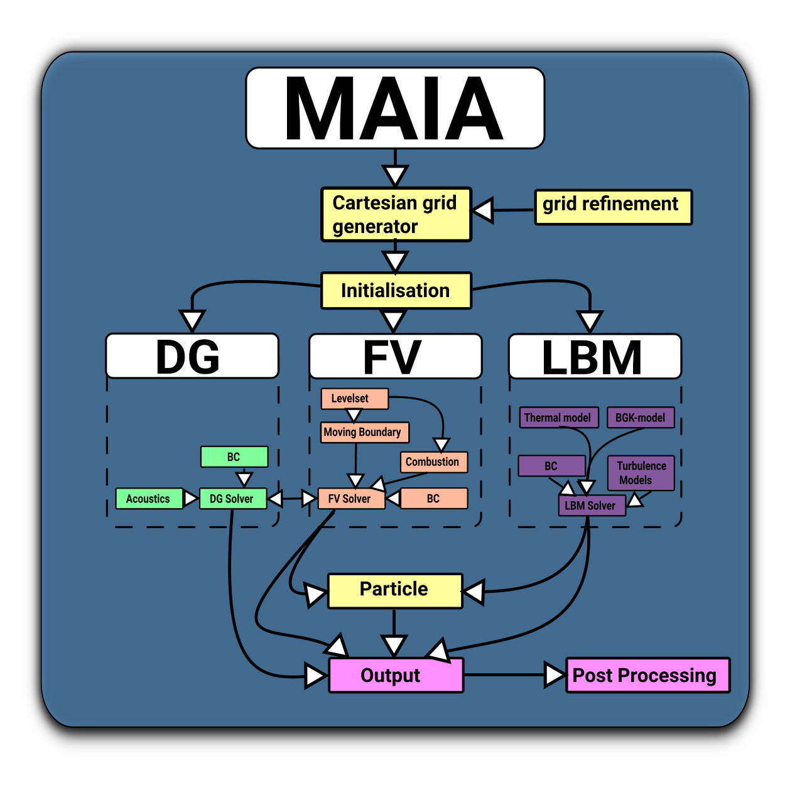

# Getting Started (Quickstart) # {#ugGettingStarted}

[TOC]

The goal of this quickstart tutorial is to get you started with @maia as fast as possible, so that you as a user can start applying the solver to testcases or [tutorials](@ref ugTutorials) and then to your specific problem without going into much detail about how @maia actually works under the hood.

## Quickstart

You can quickly start installing and using @maia by first cloning the repository (repo) of @maia, second configuring @maia, third compiling @maia and fourth running your first simulation, e.g. a testcase or [tutorial](@ref ugTutorials).

@note
As a general note for the following steps to quickstart, if you need more details about requirements, like software packages and compilers, please have a look at the [installation guide](@ref ugInstallationGuide).  

1. **Clone the repo of @maia:** For this step [git](https://git-scm.com/book/en/v2/Git-Basics-Getting-a-Git-Repository) is used.  
    
    Open the terminal on the machine where you want to install and use @maia.  
        
    If you want to isolate your @maia simulation project(s), create a folder (`yourFolder`) where you want to clone the repository (`yourRepoDirectory`) and change the directory to this folder:  
    ~~~
    cd yourRepoDirectory
    mkdir yourFolder
    cd yourFolder
    ~~~
    
    Clone the @maia repo:  
    ~~~
    git clone git@git.rwth-aachen.de:aia/MAIA/Solver.git
    ~~~
    
    Change the directory to the downloaded `Solver` folder and switch to the desired branch you want to work with:  
    ~~~
    cd Solver
    git checkout yourBranch
    ~~~
    
     
    
2. **Configure @maia:** For this step [Python](https://www.python.org/downloads/) 3.X is required.  
    
    Run the `configure.py` file in the top directory (`Solver` folder) using the default settings indicated as `? ?`:  
    ~~~
    ./configure.py ? ?
    ~~~
    
    The print message on the console should look like this:  
    ~~~
    configure.py: current host: AIA
    configure.py: selected compiler: GNU
    configure.py: selected build type: production
    configure.py: selected parallelism type: MPI+OpenMP
    configure.py: compile with HDF5 support in BigData: enabled
    configure.py: update git submodules (skip this step with --disable-updateGitSubmodules)
    Submodule 'include/Eigen' (https://gitlab.com/libeigen/eigen.git) registered for path 'include/Eigen'
    Submodule 'include/cantera' (https://github.com/Cantera/cantera.git) registered for path 'include/cantera'
    Cloning into '... /Solver/include/Eigen'...
    Cloning into '... /Solver/include/cantera'...
    Submodule path 'include/Eigen': checked out 'cd80e04ab77bec92c63a4cce1e089262334d23a9'
    Submodule path 'include/cantera': checked out '9cee0525d26b6030cc30c469c9c75332d836eb8e'
    configure.py: configuring @maia
    configure.py: @maia is ready for make!
    ~~~

     
    
3. **Compile @maia:** For this step [CMake](https://cmake.org/download/) is used.  

    Run the `Makefile` in the top directory (`Solver` folder) to compile @maia:
    ~~~
    make
    ~~~
    
    **Tip:** You can use the following command to compile @maia in parallel using `noCores` processors:
    ~~~
    make -j noCores
    ~~~
    
    This process can take some minutes even when using multiple cores. The print message on the console should look like this:  
    ~~~
    Scanning dependencies of target maia
    [  0%] Building CXX object src/CMakeFiles/maia.dir/GRID/cartesiangridgenpar_inst_2d.cpp.o
    [  2%] Building CXX object src/CMakeFiles/maia.dir/GRID/cartesiangrid_inst_2d.cpp.o
    [  3%] Building CXX object src/CMakeFiles/maia.dir/GRID/cartesiangridgenpar_inst_3d.cpp.o
    [  3%] Building CXX object src/CMakeFiles/maia.dir/GRID/cartesiangrid_inst_3d.cpp.o
    [  3%] Building CXX object src/CMakeFiles/maia.dir/GRID/cartesiangridgencell.cpp.o
    [  4%] Building CXX object src/CMakeFiles/maia.dir/FV/fvcartesiansolverxd_inst_2d_rans_fs.cpp.o
    [  4%] Building CXX object src/CMakeFiles/maia.dir/FV/fvcartesiansolverxd_inst_2d_rans_sa.cpp.o
    [  4%] Building CXX object src/CMakeFiles/maia.dir/FV/fvcartesiansolverxd_inst_3d_ns.cpp.o
    [  5%] Building CXX object src/CMakeFiles/maia.dir/FV/fvcartesiansolverxd_inst_2d_ns.cpp.o
    [  5%] Building CXX object src/CMakeFiles/maia.dir/FV/fvcartesiansolverxd_inst_2d_detchem.cpp.o
    [  7%] Building CXX object src/CMakeFiles/maia.dir/FV/fvcartesiansolverxd_inst_2d_rans_komega.cpp.o
    [  7%] Building CXX object src/CMakeFiles/maia.dir/FV/fvcartesiansolverxd_inst_3d_rans_sa.cpp.o
    [  7%] Building CXX object src/CMakeFiles/maia.dir/FV/fvcartesiansolverxd_inst_3d_rans_fs.cpp.o
    [  8%] Building CXX object src/CMakeFiles/maia.dir/FV/fvcartesiansolverxd_inst_3d_rans_komega.cpp.o
    [  9%] Building CXX object src/CMakeFiles/maia.dir/FV/fvcartesiansolverxd_inst_3d_eegas.cpp.o
    [  9%] Building CXX object src/CMakeFiles/maia.dir/FV/fvcartesiansolverxd_inst_3d_detchem.cpp.o
    [ 10%] Building CXX object src/CMakeFiles/maia.dir/FV/fvcartesiansyseqnns.cpp.o
    ...
    [ 90%] Building CXX object src/CMakeFiles/maia.dir/DG/dgcartesiansolver.cpp.o
    [ 90%] Building CXX object src/CMakeFiles/maia.dir/COUPLER/couplerfvmultilevel.cpp.o
    [ 91%] Building CXX object src/CMakeFiles/maia.dir/GEOM/geometryroot.cpp.o
    [ 92%] Building CXX object src/CMakeFiles/maia.dir/FV/fvstg.cpp.o
    [ 92%] Building CXX object src/CMakeFiles/maia.dir/COUPLER/lslb.cpp.o
    [ 93%] Building CXX object src/CMakeFiles/maia.dir/COUPLER/couplerlbfv.cpp.o
    [ 93%] Building CXX object src/CMakeFiles/maia.dir/COUPLER/couplerlbfveemultiphase.cpp.o
    [ 94%] Building CXX object src/CMakeFiles/maia.dir/COUPLER/couplerlblb.cpp.o
    [ 95%] Building CXX object src/CMakeFiles/maia.dir/COUPLER/lbrb.cpp.o
    [ 95%] Building CXX object src/CMakeFiles/maia.dir/ACA/acasolver.cpp.o
    [ 96%] Building CXX object src/CMakeFiles/maia.dir/RB/rigidbodies.cpp.o
    [ 96%] Building CXX object src/CMakeFiles/maia.dir/COUPLER/lslbsurface.cpp.o
    [ 97%] Building CXX object src/CMakeFiles/maia.dir/COUPLER/lblpt.cpp.o
    [ 98%] Building CXX object src/CMakeFiles/maia.dir/COUPLER/lbdgape.cpp.o
    [ 98%] Building CXX object src/CMakeFiles/maia.dir/COUPLER/couplingdgape.cpp.o
    [ 99%] Building CXX object src/CMakeFiles/maia.dir/maia.cpp.o
    [100%] Linking CXX executable maia
    [100%] Built target maia
    ~~~
    
    As a test, if @maia is compiled open @maia's help:  
    ~~~
    cd src
    maia -h
    ~~~
    
     

4. **Run your first simulation with @maia:** For this step a testcase or [tutorials](@ref ugTutorials) can be used as your first simulation project.  

    Go to your simulation project and create a link to the compiled @maia executable of step 3:  
    ~~~
    cd simulationProject
    ln -s yourRepoDirectory/yourFolder/Solver/src/maia maia
    ~~~
    
    As a test, check if the link is successfully created by opening @maia's help:  
    ~~~
    ll
    maia -h
    ~~~
    
    Run the simulation:  
    ~~~
    maia properties.toml
    ~~~
    
    By utilizing [OpenMPI](https://www.open-mpi.org/) you can run the simulation in parallel using `noCores` processors:  
    ~~~
    mpirun -np noCores maia properties.toml
    ~~~
    
     
    
@note
For further information how to use certain solver parts of @maia and performing your first pre- and postprocessing, please refer to the [tutorials](@ref ugTutorials).

## @maia testcases
Test cases need reference data, which are relatively large compared to the source code. Therefore, we do not keep the test cases in the git for @maia. Consequently, testcases only are available only upon request or for [AIA users](@ref ugGettingStartedAIAUsers) at the moment.

## @maia tools

Get @maia tools useful for preprocessing and postprocessing:
https://git.rwth-aachen.de/aia/MAIA/tools

## List of abbreviations
@todo
Maybe we should add a glossary of common abbreviations as a separate page that is automatically updated.

- NSE = Navier-Stokes equations
- PDE = Partial Differential Equation(s)
- ODE = Ordinary Differential Equation(s)
- CFD = Computational Fluid Dynamics
- IC = Initial Condition
- BC = Boundary Condition(s)
- DNS = Direct Numerical Simulation
- LES = Large Eddy Simulation
- RANS = Reynolds averaged Navier-Stokes simulation
- LBM = Lattice Boltzmann Method
- BL = boundary layer
- BLT = boundary layer thickness
- TBL = turbulent boundary layer
- d0 = boundary layer thickness \f$ \delta_{99} \f$, wall normal distance with 99% flow velocity of the far field velocity
- d1 = displacement thickness \f$ \delta_1 \f$
- d2 = momentum thickness \f$ \delta_2 = \Theta \f$
    - **Tip:** \f$ d0 \geq d1 \geq d2 \f$
- RST = Reynolds Shear stress Tensor

## Overview of @maia

The following graphic has to be updated: unstructured vs. structured

- DG = Discontinuous Galerkin
- FV = Finite Volume
- LB = Lattice Boltzmann

