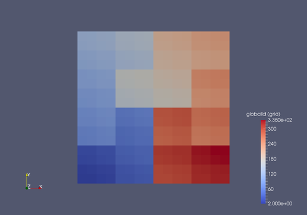
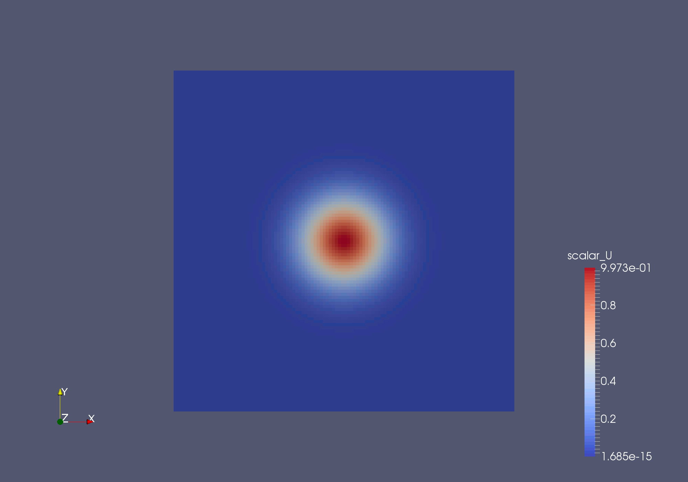

# Tutorial 1 (Setup) # {#ugTutorial1cartesian}
[TOC]

This tutorial details the steps necessary to setup and run a basic simulation using MAIA. 

## Installation

Refer to the instructions given in the [installation](@ref ugInstallationGuide) section and complete the following tasks:

1. Clone a recent version of MAIA from **GIT** .
2. Compile a version of MAIA with **production** settings using the **GNU** compiler. 

## Default File Structure
The default folder structure and used files in the tutorials are:  

<table>
<tr><th> Folder / file name     </th>  <th> Applications </th></tr>
<tr><td> /stl                   </td>  <td> Contains the STL data of the geometry </td></tr> 
<tr><td> /out                   </td>  <td> Contains the results and the grid file </td></tr>
<tr><td> /reference             </td>  <td> Contains the reference data for the test case (optional) </td></tr> 
<tr><td> geometry.toml          </td>  <td> Configuration file used to define the **geometry** and **boundary conditions** </td></tr>
<tr><td> properties_grid.toml   </td>  <td> Configuration file used to define properties for the **grid generator** </td></tr>
<tr><td> properties_run.toml    </td>  <td> Configuration file used to define properties for the **solver run** </td></tr>
<tr><td> properties_restart.toml</td>  <td> Configuration file used to define properties for the **solver restart** </td></tr>
<tr><td> \*.stl                 </td>  <td> Geometry data file </td></tr>
<tr><td> \*.netcdf              </td>  <td> Result data in NetCDF format </td></tr>
<tr><td> \*.vtk/vtu/vtp         </td>  <td> Result data for visualization </td></tr>
</table>

## Test Case Setup
1. **Download** the test case file for tutorial 1: [WS1.zip](https://git.rwth-aachen.de/aia/MAIA/Solver/-/wikis/uploads/36b1db783982daa8cbcff4ba5e1ca2b4/WS1.zip)
2. In the top directory of WS1, **Link** your maia executable into the tutorial directory, such you can access it easily from within:  
   <code> ln -s <path_to_the_MAIA_directory>/src/maia ./maia</code>  
3. **Configure** properties in the file *geometry.toml*, *properties_grid.toml* and *properties_run.toml*. Prepare for the simulation. 

**Note**: You can leave the property files as it is, since this first tutorial is aimed to simply illustrate the overview of the simulation workflow. We will play with the property setups in the following tutorials.

## Test Simulation
### 1) Grid Generation
Before running a simulation, the grid file of the test case has to be generated.
- Run MAIA in the top directory of WS1, while giving *properties_grid.toml* as a command line argument:  
  <code> ./maia properties_grid.toml</code>
- As a result you should now see the following outputs in the terminal:

~~~
Global MPI information
MPI Info: nkeys = 1
MPI Info: [0] key = nc_header_align_size, value = 10240
     _____ ______    ________   ___   ________      
____|\   _ \  _   \ |\   __  \ |\  \ |\   __  \ ___    
 ___\ \  \\\__\ \  \\ \  \|\  \\ \  \\ \  \|\  \ ___   
  ___\ \  \\|__| \  \\ \   __  \\ \  \\ \   __  \ ___  
   ___\ \  \    \ \  \\ \  \ \  \\ \  \\ \  \ \  \ ___ 
    ___\ \__\    \ \__\\ \__\ \__\\ \__\\ \__\ \__\ ___
     ___\|__|     \|__| \|__|\|__| \|__| \|__|\|__| ____

Start time:            2023-01-23 09:00:00
Number of ranks:       **
Number of OMP threads: **
Host (of rank 0):      **
Working directory:     <path_to_the_test_case_directory>/WS1
User:                  **
Executable:            maia
Command line args:     maia properties_grid.toml

m_noSolvers: 1
Parallel grid generator started on process 0
  (1) reading properties
  (2) initializing member variables
  (3) initializing geometry
      + center of gravity: 0 0 
      + decisive direction: 0
      + geometry extents: 2 2 
      + bounding box: -1 -1 1 1 
  (4) creating initial grid
      + refining from: 0 to 2
      + initial cube size: 2
      + refining grid on level 0:     
100% done.
      * finding the neighbors for the new level
      * detecting outside cells to delete:
        - outside cells deleted: 0
        - new offsets: 9996 10000
      + refining grid on level 1:     
100% done.
      * finding the neighbors for the new level
      * detecting outside cells to delete:
        - outside cells deleted: 0
        - new offsets: 0 16
      + created 16 cells for level 2
      + creating Hilbert curve
      * resorting cells after Hilbert id
      + refining grid on level 2:     
100% done.
      * detecting outside cells to delete:
        - outside cells deleted: 0
        - new offsets: 16 80
      + refining grid on level 3:     
100% done.
      * detecting outside cells to delete:
        - outside cells deleted: 0
        - new offsets: 80 336
      + checking mesh validity for LB
      * mesh is OK
      + reordering global ids
      * traversing all cells depth-first
      * finding partition cells
         - found 16
  (7) writing grid to file
g_multiSolverGrid: 0
      + grid file written to './out/grid.Netcdf'
=== PARALLELIO FILE LIFETIME: ./out/grid.Netcdf      |7.2110e-03 s |
(8) Cleaning up
~~~

* **Congratulations !** You just created your first grid file with MAIA.
* Run ParaView with the command: <code> parav</code> and open the just created ./out/grid.Netcdf.

**Note**: If you get the message cannot connect to x-server. You need to use the command **ssh -X** to connect to the server you want to run paraview on.

* Select <code> globalid (grid)</code> in the property list and you will see the follwing results:  
  

### 2) Run a Simulation
After the grid generation, we can start the simulation.
* In the top directory of WS1, run MAIA agian while giving *properties_run.toml* as a command line argument:  
  <code> ./maia properties_run.toml</code>
* Output in terminal:

~~~
Global MPI information
MPI Info: nkeys = 1
MPI Info: [0] key = nc_header_align_size, value = 10240
     _____ ______    ________   ___   ________      
____|\   _ \  _   \ |\   __  \ |\  \ |\   __  \ ___    
 ___\ \  \\\__\ \  \\ \  \|\  \\ \  \\ \  \|\  \ ___   
  ___\ \  \\|__| \  \\ \   __  \\ \  \\ \   __  \ ___  
   ___\ \  \    \ \  \\ \  \ \  \\ \  \\ \  \ \  \ ___ 
    ___\ \__\    \ \__\\ \__\ \__\\ \__\\ \__\ \__\ ___
     ___\|__|     \|__| \|__|\|__| \|__| \|__|\|__| ____

Start time:            2023-01-23 09:01:00
Number of ranks:       **
Number of OMP threads: **
Host (of rank 0):      **
Working directory:     <path_to_the_test_case_directory>/WS1
User:                  **
Executable:            maia
Command line args:     maia properties_run.toml

m_noSolvers: 1

=== MAIA RUN LOOP ===

=== MAIA RUN DURATION: Create geometries                   | min: 9.2793e-04 s | avg: 9.2793e-04 s | max: 9.2793e-04 s |
=== Create grid...
=== Create Cartesian grid...
Grid consisting of 1 solvers.
#### WARNING: haloMode==0 is deprecated!!!
Loading grid file ././out/grid.Netcdf
=== MAIA GRID DURATION: Open grid file                     | min: 2.0249e-03 s | avg: 2.0249e-03 s | max: 2.0249e-03 s |
=== MAIA GRID DURATION: Read attributes etc                | min: 7.0095e-05 s | avg: 7.0095e-05 s | max: 7.0095e-05 s |
  * partition grid on 1 domains... 
=== MAIA GRID DURATION: Partition                          | min: 9.3222e-05 s | avg: 9.3222e-05 s | max: 9.3222e-05 s |
  * create data structure for 336 cells
=== MAIA GRID DURATION: Read cell info                     | min: 1.5020e-05 s | avg: 1.5020e-05 s | max: 1.5020e-05 s |
=== MAIA GRID DURATION: Correct offsets PLS                | min: 1.2875e-05 s | avg: 1.2875e-05 s | max: 1.2875e-05 s |
=== MAIA GRID DURATION: Read solver info                   | min: 5.9605e-06 s | avg: 5.9605e-06 s | max: 5.9605e-06 s |
  * setup grid connectivity from level 2 to 4
=== MAIA GRID DURATION: Read min cell info                 | min: 7.7963e-05 s | avg: 7.7963e-05 s | max: 7.7963e-05 s |
=== MAIA GRID DURATION: Exchange partition level ancestors | min: 3.8147e-06 s | avg: 3.8147e-06 s | max: 3.8147e-06 s |
=== MAIA GRID DURATION: Setup local grid subtrees          | min: 4.0531e-06 s | avg: 4.0531e-06 s | max: 4.0531e-06 s |
=== MAIA GRID DURATION: Propagate neighbors                | min: 1.6499e-04 s | avg: 1.6499e-04 s | max: 1.6499e-04 s |
done.
=== MAIA GRID DURATION: Load grid total                    | min: 2.6278e-03 s | avg: 2.6278e-03 s | max: 2.6278e-03 s |
=== PARALLELIO FILE LIFETIME: ././out/grid.Netcdf          | 2.9480e-03 s |
===   0.60 KB globally allocated by CartesianGrid. Total global memory: 0.60 KB. ===
===   0.60 KB maximum globally allocated by CartesianGrid. ===
=== done.
=== MAIA RUN DURATION: Create grid                         | min: 3.7968e-03 s | avg: 3.7968e-03 s | max: 3.7968e-03 s |

FV-MB is off
FV-LS is off
LB is off
LB LS is off
LS SOLVER is off
COMBUSTION is off
DG is off
LS-RANS is off
=== Create solvers...
=== Create MAIA_DISCONTINUOUS_GALERKIN...
Solver #0 - maximum number of DG elements among ranks: 256
Solver #0 - minimum number of DG elements among ranks: 256
Solver #0 - maximum number of DG surfaces among ranks: 30000
===   0.00 KB globally allocated by DgCartesianSolver (solverId = 0). Total
global memory:   0.60 KB. ===
===   0.00 KB maximum globally allocated by DgCartesianSolver (solverId = 0). ===
=== done.
=== MAIA RUN DURATION: Create solver #0                    | min: 3.0832e-03 s | avg: 3.0832e-03 s | max: 3.0832e-03 s |
=== MAIA RUN DURATION: Create solvers                      | min: 3.0949e-03 s | avg: 3.0949e-03 s | max: 3.0949e-03 s |
=== Create couplers...
=== done.
=== MAIA RUN DURATION: Create couplers                     | min: 4.0531e-06 s | avg: 4.0531e-06 s | max: 4.0531e-06 s |
=== Create grid controller...
=== done.
=== MAIA RUN DURATION: Create grid controller              | min: 1.0300e-04 s | avg: 1.0300e-04 s | max: 1.0300e-04 s |
=== Init solvers...
=== MAIA RUN DURATION: Init solver #0                      | min: 6.5708e-04 s | avg: 6.5708e-04 s | max: 6.5708e-04 s |
=== MAIA RUN DURATION: Init solvers                        | min: 8.2397e-04 s | avg: 8.2397e-04 s | max: 8.2397e-04 s |
=== Init couplers...
=== MAIA RUN DURATION: Init couplers                       | min: 3.0994e-06 s | avg: 3.0994e-06 s | max: 3.0994e-06 s |
=== done.
=== Initial adaptation...
=== done.
=== Finalize initialization of solvers and couplers...
=== PARALLELIO FILE LIFETIME: ././out/solution_00000000.Netcdf    | 5.5048e-03 s

--------------------------------------------------------------------------------
 SOLVER 0 INITIALIZATION SUMMARY AT TIME STEP 0
--------------------------------------------------------------------------------
 PROBLEM SUMMARY
 | System of equations                     | DG_SYSEQN_LINEARSCALARADV          |
 | Number of dimensions                    |                                  2 |
 | Number of variables                     |                                  1 |
 | | Conservative variable name(s)         | scalar                             |
 | Restart                                 |                                 no |
 | Initial condition                       |                                  5 |
 | Start time (non-dimensionalized)        |                           0.000000 |
 | Final time (non-dimensionalized)        |                           3.000000 |
 | CFL                                     |                           1.000000 |
 | Recalculation interval for time step    |                                  0 |
 | Time step                               |                                  0 |
 | Maximum number of time steps            |                              20000 |

 DISCRETIZATION SUMMARY
 | Initial polynomial degree               |                                  3 |
 | Minimum polynomial degree (limit)       |                                  3 |
 | Maximum polynomial degree (limit)       |                                  3 |
 | Polynomial type                         | Legendre                           |
 | Integration method                      | Gauss                              |
 | Time integration scheme                 | Carpenter 4/5                      |

 PARALLELIZATION SUMMARY
 | Domain id                               |                                  0 |
 | Number of neighbor domains              |                                  0 |
 | Number of exchange neighbor domains     |                                 -1 |
 | Total number of domains                 |                                  1 |

 GRID SUMMARY (LOCAL)
 | Minimum used polynomial degree          |                                  3 |
 | Maximum used polynomial degree          |                                  3 |
 | Average used polynomial degree          |                           3.000000 |
 |                                         |
 |
 | Minimum grid level                      |                                  2 |
 | Maximum grid level                      |                                  4 |
 |                                         |                                    |
 | Number of cells                         |                                336 |
 | | internal cells                        |                                336 |
 | | halo cells                            |                                  0 |
 | Number of active cells                  |                                256 |
 | Number of active DOFs                   |                               4096 |
 | Max. number of cells (collector size)   |                              10001 |
 | Memory utilization                      |                           3.359664 |
 |                                         |
 |
 | Number of elements                      |                                256 |
 | Number of helements                     |                                  0 |
 |                                         |                                    |
 | Number of surfaces                      |                                544 |
 | | boundary surfaces                     |                                 64 |
 | | inner surfaces                        |                                480 |
 | | MPI surfaces                          |                                  0 |
 | Max. number of surfaces (collector size)|                              30000 |
 | Memory utilization                      |                           1.813333 |

 GRID SUMMARY (GLOBAL)
 | Minimum used polynomial degree          |                                  3 |
 | Maximum used polynomial degree          |                                  3 |
 | Average used polynomial degree          |                           3.000000 |
 |                                         |                                    |
 | Minimum grid level                      |                                  2 |
 | Maximum grid level                      |                                  4 |
 |                                         |                                    |
 | Number of cells                         |                                336 |
 | | internal cells                        |                                336 |
 | | halo cells                            |                                  0 |
 | Number of active cells                  |                                256 |
 | Number of active DOFs                   |                               4096 |
 | Max. number of cells (collector size)   |                              10001 |
 | Memory utilization                      |                           3.359664 |
 |                                         |                                    |
 | Number of elements                      |                                256 |
 | Number of helements                     |                                  0 |
 |                                         |                                    |
 | Number of surfaces                      |                                544 |
 | | boundary surfaces                     |                                 64 |
 | | inner surfaces                        |                                480 |
 | | MPI surfaces                          |                                  0 |
 | | Surfaces marked for p-ref             |                                  0 |
 | | Surfaces marked for h-ref             |                                  0 |
 | Max. number of surfaces (collector size)|                              30000 |
 | Memory utilization                      |                           1.813333 |

 BOUNDARY CONDITIONS
 | exact                                   |                                  0 |

 CUT-OFF BOUNDARY CONDITIONS
 | Enabled?                                |                                 no |

 SBP MODE
 | Enabled?                                |                                 no |
 | Operator                                |                                    |

--------------------------------------------------------------------------------

--------------------------------------------------------------------------------
 Solver 0 running 'DG_SYSEQN_LINEARSCALARADV' with N = 3 and maxLevel = 4
--------------------------------------------------------------------------------
 No. timesteps: 0
 dt:            0.000000e+00
 Run time:      0.000000e+00 s
 Time/DOF/step: 0.000000e+00 s
 Variable:      scalar      
 L^2 error:     3.105439e-05
 L^inf error:   5.146002e-04
--------------------------------------------------------------------------------
 Simulation time: 0.000000e+00
--------------------------------------------------------------------------------

=== MAIA RUN DURATION: Finalize initialization solver #0   | min: 6.9990e-03 s | avg: 6.9990e-03 s | max: 6.9990e-03 s |
=== MAIA RUN DURATION: Finalize initialization             | min: 7.0081e-03 s | avg: 7.0081e-03 s | max: 7.0081e-03 s |
=== done.
=== MAIA RUN DURATION: Finalize coupler init               | min: 9.536Download WS2.zip default case setup archive. It contains all absolutely necessary files and folders with basic default settings. All necessary properties are given in the configuration file7e-07 s | avg: 9.5367e-07 s | max: 9.5367e-07 s |
=== MAIA RUN DURATION: Full initialization                 | min: 1.6179e-02 s | avg: 1.6179e-02 s | max: 1.6179e-02 s |

=== PARALLELIO FILE LIFETIME: ././out/solution_00000020.Netcdf    | 6.5930e-03 s |
=== PARALLELIO FILE LIFETIME: ././out/solution_00000040.Netcdf    | 5.4438e-03 s |
=== PARALLELIO FILE LIFETIME: ././out/solution_00000060.Netcdf    | 5.2888e-03 s |
=== PARALLELIO FILE LIFETIME: ././out/solution_00000080.Netcdf    | 5.1889e-03 s |
=== PARALLELIO FILE LIFETIME: ././out/solution_00000100.Netcdf    | 5.3329e-03 s |
=== PARALLELIO FILE LIFETIME: ././out/solution_00000120.Netcdf    | 5.4479e-03 s |
=== PARALLELIO FILE LIFETIME: ././out/solution_00000140.Netcdf    | 5.3840e-03 s |
=== PARALLELIO FILE LIFETIME: ././out/solution_00000160.Netcdf    | 5.5170e-03 s |
=== PARALLELIO FILE LIFETIME: ././out/solution_00000180.Netcdf    | 4.8411e-03 s |

--------------------------------------------------------------------------------
 Solver 0 running 'DG_SYSEQN_LINEARSCALARADV' with N = 3 and maxLevel = 4
--------------------------------------------------------------------------------
  No. timesteps: 193
  dt:            1.203231e-02
  Run time:      1.481519e-01 s
  Time/DOF/step: 1.252514e-07 s
  Variable:      scalar      
  L^2 error:     2.408991e-32
  L^inf error:   1.210788e-30
--------------------------------------------------------------------------------
 Simulation time: 3.000000e+00
--------------------------------------------------------------------------------

--------------------------------------------------------------------------------
 MAIA finished.   Final time: 3   Time steps: 193
--------------------------------------------------------------------------------
Writing restart files at time step 193 :
=== PARALLELIO FILE LIFETIME: ././out/restart_00000193.Netcdf     | 6.8870e-03 s |
=== PARALLELIO FILE LIFETIME: ././out/solution_00000193.Netcdf    | 4.6918e-03 s |
~~~

**Congratulations !** You completed your first simulation with MAIA.
* Open ./out/solution\_00000\* files in ParaView. 
* Select <code> scalar</code> in the property list. The results should look like this:

