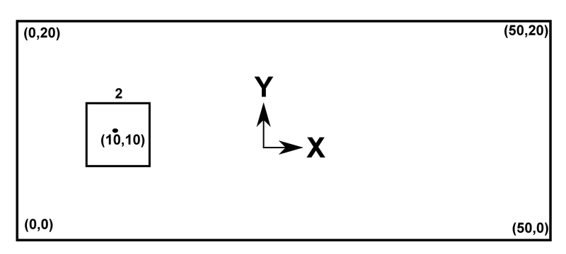
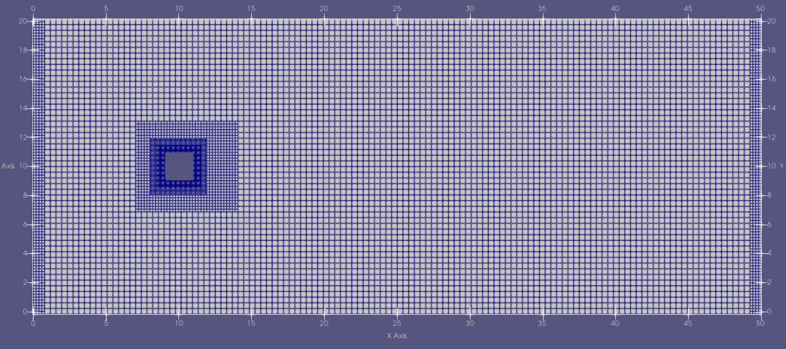

# Tutorial 2 (First Simulation) # {#ugTutorial2cartesian}
[TOC]

In the second tutorial, we will simulate the flow around a 2D square which exhibits the vortex shedding phenomenon. We will build up the simulation step by step, including configuring the property files in (1) geometry setup, (2) grid generation and (3) flow simulaiton. In the end, you will be able to build up your own simluation cases.

* To get started, **download** [WS2.zip](https://git.rwth-aachen.de/aia/MAIA/Solver/-/wikis/uploads/30616441a9c47b94c91d5321e815f6b2/WS2.zip) default case setup archive. It contains all absolutely necessary files and folders with basic default settings. All necessary properties are given in the configuration files.

## Geometry Setup

**General Ideas**

To simulate the flow around a 2D square, we need to define a computational domain surrounding our object. For this tutorial, we simply define a 2D rectangular box as the boundary of the compuataional domain.

To limit the effect of disturbances cased by the boundary conditions, we need to place the boundary sufficiently far away from the object (the 2D square). Furthermore, since we are intersetd in the vortex shedding phenomeon downstream the obejct, we need to make the flow domain extend far enough in the flow direction. Check the follwoing image for some suggested geometry setups.  

**Implimentation**

### 1) STL Data

The geometry consists of 5 parts (4 boundary segments and 1 squre object) and they are supposed to be stored in STL files. 

In this tutorial, you need to create the STL files, copy the given content from below into each file and place them in the <code>/stl</code> folder. (Optional: After completing the simulation you're free to try different geometries.)

The STL in 2D is made up of the following information:
* The number of vertices
* The 2D coordinates of the vertices with a '.' and separated by a blank   
**Note:** Closed geometries need to be in a loop (i.e. start and end on the same location).  

**inlet.stl**
~~~ 
 2
 
 0.0 0.0
 0.0 20.0
~~~
**outlet.stl**
~~~ 
 2
 
 50.0 0.0 
 50.0 20.0
~~~
**upperSponge.stl** 
~~~ 
 2
 
 0.0 20.0 
 50.0 20.0
~~~
**lowerSponge.stl** 
~~~ 
 2
 
 0.0 0.0
 50.0 0.0
~~~
**square.stl**
~~~ 
 5
 
 9.0 11.0
 11.0 11.0
 11.0 9.0
 9.0 9.0
 9.0 11.0
~~~

After creating geometry STL files, we need to specify the them in the <code> geometry.toml</code> file. Follow the instructions given in the *geometry.toml* file and fill in all the missing values with <code>?</code>.

**Note:** For detailed information, please check [property file overview (old)](http://ldap2.aia.rwth-aachen.de/mediawiki-1.22.1/index.php5/ZFS:Property_Files) and [geometry generation documentation (old)](http://ldap2.aia.rwth-aachen.de/mediawiki-1.22.1/index.php5/ZFS:Geometry).

### 2) Boundary Conditions 
Define the Boundary Conditions in the <code>geometry.toml</code>: 
* 1001 (inflow)
* 1002 (outflow)
* 1012 (outflow with sponge)
* 3003 (wall boundary condition)

Now we have finished the geometry setups! You can find the **reference solution** of the *geometry.toml* file in the <code>/solution</code> folder.  

## Grid Generation
Fill in all missing values in <code>properties_grid.toml</code> to configure properties in the grid generation process. Some suggestions are given for the refinment properites. 
* The *maxNoCells* should be well below **50,000** to keep computation time low.
* Use minLevel <= maxUniformRefinementLevel < maxBoundaryRfnLvl <= maxRfnmntLvl
* Make sure **maxRfnmntLvl <= 10** otherwise the grid gets too big for the further steps.

Generate the grid by running the MAIA (with properties_grid.toml) and view it using ParaView. For more detail on how to setup and run the simulation with MAIA, please refer to [Tutorial 1](@ref ugTutorial1cartesian).

**Optional:** You can play with the values in properties_grid.toml until you think the resulting grid is satisfying. Remember: there are multiple grid setup possibilities!
* Try to find a good setup for the grid generation by introducing different refinement levels and types.
* Try to find a good combination of *localMinBoundaryThreshold* and *smoothDistance* at the in- and outlet refinement to avoid large cells to allow for a good LBM computation.  

Below is a reference grid solution generatied by property files in the <code>/solution</code> folder.  

# Flow Simulation
Add all the missing values to the exemplary <code>properties_run.toml</code>. Use the following settings:
* Number of timesteps = 100000
* If your simulation diverges try a lower CFL number (not smaller than 0.1)
* Use the same grid and refinment properties as in your *properties_grid.toml*

**Parallel Computing:** Flow simulation consumes a lot of computational resources, therefore it is a better idea to conduct the simulation on computational nodes with multiple process. MAIA is designed to achieve efficient parallel computing on computational nodes.

With SLURM in AIA cluster, you can use the following commmand to obtain an interactive job, then run parallel computing simulation using MPI.
* First login via ssh to front nodes: <code>ssh -X fe1</code>.
* Require an interactive job: <code>si -X {nProcs/node} {nNodes} {hh:mm:ss}</code>, e.g. <code>si -X 12 1 00:15:00</code>.
* Start parallel computing simulation: <code>mpirun -np 12 ./maia properties_run.toml</code>.

**Note:** **Never** run any long simulations (>60s) or any simulation using more than 1 or 2 cores on one of the frontend nodes!

Finally, you can visualize the results in ParaView. The result should look like this:  
.
