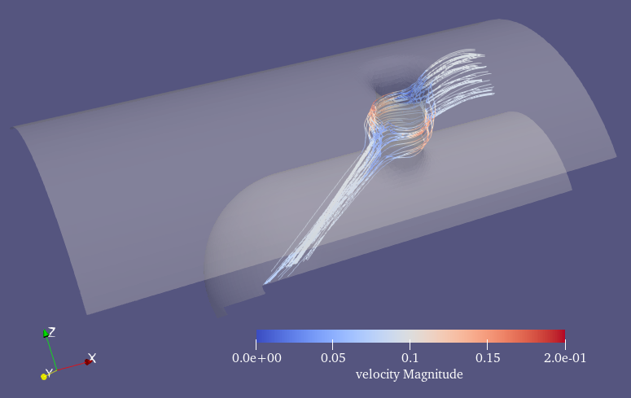
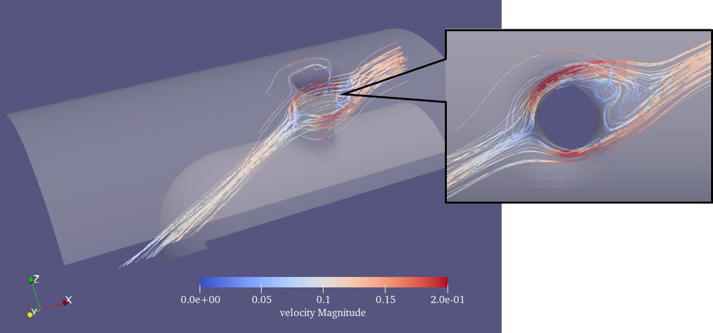

# Tutorial 4 (FV Solver) # {#ugTutorial4cartesian}
[TOC]

Welcome to the 4th part of the tutorial. In this part, you'll learn the theory behind the finite volume (FV) part of the code and how to use it yourself. 

## Theory

See [Theory & Implementation Finite Volume (FV) (old)](http://ldap2.aia.rwth-aachen.de/mediawiki-1.22.1/index.php5/ZFS:Theory_%26_Implementation_Finite_Volume_(FV)).

## Tutorial
* Compile maia in production, e.g. <code>./configure.py gnu production</code>
* Take a single twelve node interactive session, see [this tutorial](@ref ugTutorial2cartesian).
* Run ParaView in an additional terminal from your local device within the tutorials' directory.

**FV 3D_cyl_fan**   
To begin with, we will run a normal FV case and change some of its numerical value to show what we can influence. In this case, a stream flows into a 3D cylinder with a 45-degree angle of rotation around the z-axis which imitates a fan. The flow around one of the pylons Mach speed 0.1 and Re 50000 is simulated.

### 1. Getting the files and running them with default values
Download the test case setup files, and create a soft link to the solver executable:
~~~
svn co http://svn.aia.rwth-aachen.de/maia/testcases/FV/3D_cyl_fan
cd 3D_cyl_fan
ln -s <path_to_the_MAIA_directory>/src/maia ./maia
~~~

On AIA cluster, obtain an interactive sussion, then generate the grid and run simulation:  
~~~
ssh -X fe1
si -X 12 1 00:15:00
mpirun -np 1  ./maia properties_grid.toml
mpirun -np 12 ./maia properties_run.toml
~~~
**Note:** For better visualization of the geometry, set <code>outputFormat="VTU"</code> in properties_run.toml.

In an additional local terminal, run ParaView for post-processing:
~~~ 
parav
~~~
* Open the file *out/GEOM_10.vtp* and *out/QOUT_10.vtu*. Show them individually. You will see the *GEOM* file contains the wall boundary of the fan and the *QOUT* file saves the flow field data.
* Select the *GEOM* file, show it and set <code> Styling/Opacity =  0.3</code>.
* Select the *QOUT* file, hide it and create a stream-tracer fileter on the velocity vector. For the stream-tracer filter properties, set <code>Seed Type = Point Source</code>, <code>Sphere Center = [50, 185, 215]</code>, <code>Sphere Radius = 5</code>, and cancell *Show Sphere*. Press apply and color the stream lines with velocity magnitude.
* Now we can see a group of streamlines flow through the cylinder fan.

Only one output file and pretty early (10 timesteps). Sadly not much to see... so let's continue!

### 2. Setup restart and increase timesteps
* Create a restart property file, using <code> cp properties_run.toml properties_restart.toml</code>
* In *properties_restart.toml*, set <code>restartFile = true</code>, <code>restartTimeStep = 10</code> and <code>timeSteps = 200</code>.
* Remove the old solution file(s) <code>rm out/QOUT* out/GEOM*</code>  
* Restart the simulation <code>mpirun -np 12 ./maia properties_restart.toml</code>
* parav
  * Open the file list *out/GEOM_**.vtp* and *out/QOUT_**.vtu*.
  * Repeat the rest ParaView operations in the previous subsection.
  * Press <code>play</code>, we can see the change in the streamlines from time step 10 until time step 210. At later timesteps, flow separation after the cylinder can be observed.

Now the simulated flow visualization is good, let's change the physics and numeric of the simulation.

### 3. Changing physics and numeric (optional) 
* Open *properties_run.toml*, look at the <code> # PHYSICS</code> and <code> # NUMERICS</code> part.
* Play around with the properties and rerun the simulation. For example: change **angle** from  [45.0, 0.0] to [0.0, 0.0] *Angles of rotation around the z and y axis*, to see how the flow angle affects the stream lines.

