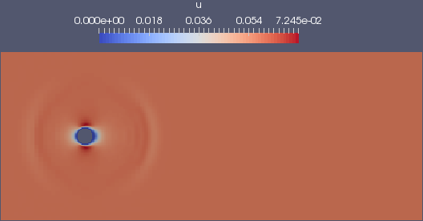
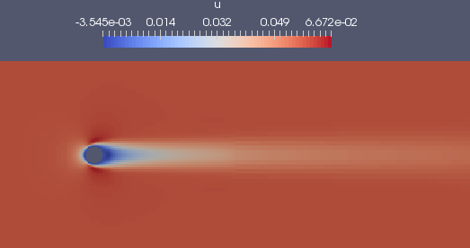
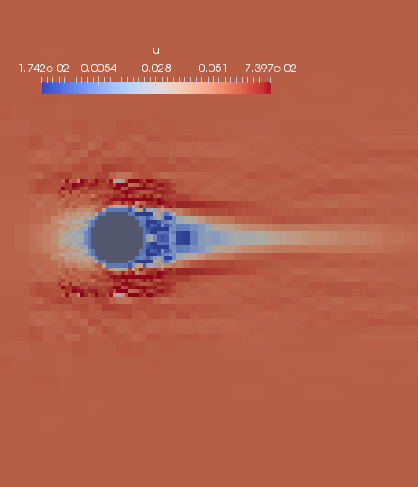
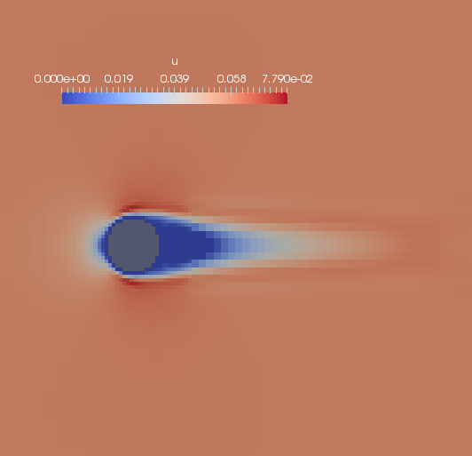

# Tutorial 5 (LBM Solver) # {#ugTutorial5cartesian}
[TOC]

Welcome to the 5th part of the tutorial. In this part, you'll learn the theory behind the lattice Boltzmann method (LBM) part of the code and how to use it yourself.

## Theory 
See [Theory & Implementation Lattice Boltzmann Method (LBM) (old)](http://ldap2.aia.rwth-aachen.de/mediawiki-1.22.1/index.php5/ZFS:Theory_%26_Implementation_Lattice_Boltzmann_Method_(LBM)).

## Tutorial Part I: Run & Restart 3D laminar sphere
### Set-Up 
In this tutorial we are using a test case as our layout, dealing with a 3D flow around a sphere.
After checking out the relevant case:
~~~
svn co http://svn.aia.rwth-aachen.de/maia/testcases/LB/3D_sphere_Re100_parallel
~~~
link your MAIA binary (git version, compiled with gnu compiler in at least production mode <code>./configure 1 2</code>).

As you see, the test case already provide a _reference/_ directory, which is used by our test tool as reference for regression testing.

### Run 
Before touching the property files generate the grid and run the simulation (either from your local host or by using an interactive session as shown in previous tutorials).
~~~
 mpirun -np 4 ./maia properties_grid.toml
 mpirun -np 4 ./maia properties_run.toml
~~~
Now, inspect your results using _parav_. Therefore, open the file *out/PV_100.Netcdf* and create a plane showing the velocity component _u_ for example:

By using *out/restart_100.Netcdf* file, you will open the same results. This type of file offers the possibility to restart the simulation from the given simulation step, whereas the <em>PV_*</em> files only dump data that are relevant for post-processing but are not satisfactory to restart from. Therefore, the <em>PV_*</em> files , also called solution files, are much smaller as you can see by:
~~~
 ls -lh out/
~~~

### Restart
Unfortunately, the preliminary run does not cover a great period of time to keep the test case as small as possible. Now we are interested to continue the simulation from the given restart file and simulate a longer period of time.
Copy the *properties_run.toml* file:
~~~
 cp properties_run.toml properties_restart.toml
~~~
and open the *properties_restart.toml* file with an editor of your choice.

Change the file such that the simulation:
* restart from the given restart file at time step 100
* runs further 9900 time steps
* only dump a solution file each 1000 iterations
* only dump a restart file each 10000 iterations

First try on your own before checking the [solution](https://git.rwth-aachen.de/aia/MAIA/Solver/-/wikis/uploads/6cb1f9227bdc80378d709699e23e24db/properties_restart.toml)

Now run the code again using the restart file:
~~~
 mpirun -np 12 ./maia properties_restart.toml
~~~

Again, open the last solution file using parav and visualize the following:

Congratulation ! You did your first LBM run including restarting.

## Tutorial Part II: 3D sphere high Reynolds number

Change the *properties_restart.toml* file the following:
~~~
 Re = 4000
 solutionInterval = 100
 timeSteps = 1300
~~~
and rerun the simulation. This time we are using a simple time measurement:
~~~
 SECONDS=0 && mpirun -np 12 ./maia properties_restart.toml && echo "Runtime: "$SECONDS"s"
~~~
Checking again the last solution file *out/PV_1400.Netcdf*:

This time the solution is bad and, indeed, is crashing if continue running.
Reasons are related to 
~~~
 solverMethod = "MAIA_LATTICE_BGK"
~~~
which is a LBM method that is only valid for low Reynolds numbers.
Create again a new run file:
~~~
 cp properties_restart.toml properties_run_cumulant.toml
~~~
and change:
~~~
 restartFile = false
 timeSteps = 1400
 solverMethod = "MAIA_LATTICE_CUMULANT"
 noDistributions = 27 # number of discrete velocities
~~~
This provides a method for higher Reynolds number.
Rerun the simulation and check results again:

Now, the results looks much better. Therefore, the second run took twice times longer than the first one.

**TODO:**
* grid changes
* other LBM methods + noDistributions

