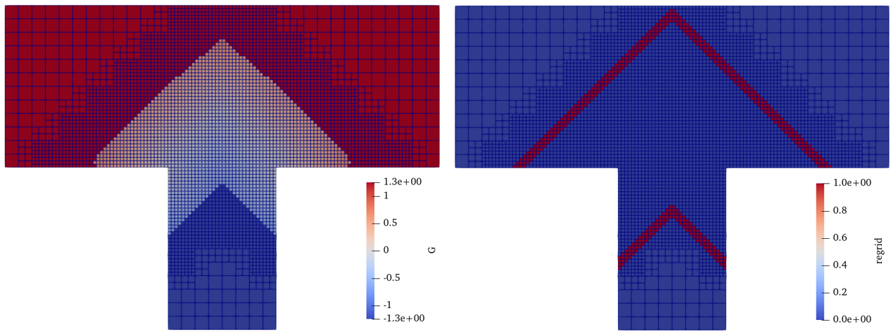
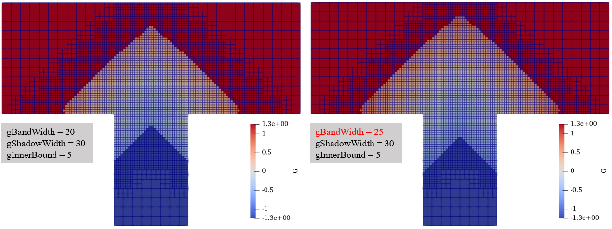
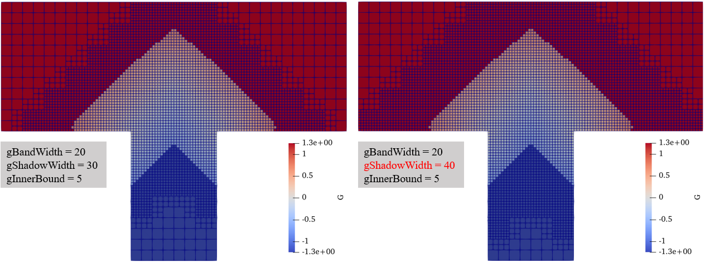
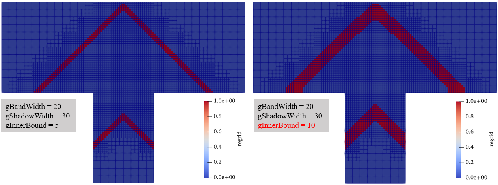

# Tutorial 6 (Level-Set Solver) # {#ugTutorial6cartesian}
[TOC]

In this part, we will run a test case that couples the finite-volume (FV) solver and level-set (LS) solver. You'll learn the theory behind the FV and LS part of the code and how to use it yourself.

## Theory

See [Theory & Implementation Finite Volume (FV) (old)](http://ldap2.aia.rwth-aachen.de/mediawiki-1.22.1/index.php5/ZFS:Theory_%26_Implementation_Finite_Volume_(FV)).

## Tutorial
* Compile maia in production, e.g. <code>./configure.py gnu production</code>
* Take a single twelve node interactive session, see [Workshop2](@ref ugWorkshop2).
* Run ParaView in an additional terminal from your local device within the tutorials' directory.

**FV 3D_turbulent_flame_MP**  
**TODO:** Need more description on the tutorial. What is 3D turbulent flame?

### 1. Get the files
~~~ 
 svn co http://svn.aia.rwth-aachen.de/maia/testcases/FV/3D_turbulent_flame_MP
 cd 3D_turbulent_flame_MP
 ln -s <path_to_the_MAIA_directory>/src/maia ./maia
~~~
### 2. Create the grid and run the files
Open the file *properties_grid.toml* and change the settings of the ifinement to the following:
* minLevel = 8
* maxUniformRefinementLevel.0 = 10
* maxUniformRefinementLevel.1 = 9
* maxRefinementLvl.0 = 11
* maxRefinementLvl.1 = 10

Now we are going to create a grid:
~~~
 ./maia properties_grid.toml
~~~

Create a copy of *properties_restart_0.toml* and name it *properties_runTo100.toml*:
~~~
cp properties_restart_0.toml properties_runTo100.toml
~~~

Change the following properties in the *properties_runTo100.toml*:
* Change **maxRfnmntLvl** from 9 to 11
* Change **timeSteps** from 4 to 100
* Change **solutionInterval** from 1 to 100
* Change **restartInterval** from 3 to 100
* Change **maxNoCells** from 800000 to 200000
* Change **maxNoBndryCells** from 100000 to 50000
* Change **maxNoSurfaces** from 5000000 to 500000

Run the simulation with 12 cores:
~~~
si -X 12 1 00:15:00
mpirun -np 12 ./maia properties_runTo100.toml
~~~

Visualize in ParaView:
  * Open the file restartLSCG_1_100.Netcdf
  * Create a slice in the Z normal
  * Change **Surface** to **Surface With Edge**
  * Look at the values **G** and **regrid**

### 3. Modify of the levelset grid
The levelset grid is controlled by 3 properties:
* **gBandWidth** sets the width of the computation band around the levelset function.  
* **gShadowWidth** sets the width of the whole levelset band around the levelset function.
* **gInnerBound** sets the width of the regrid band

Try to change any of these values in *properties_runTo100.toml* and rerun the simluation. Compare with the
results from before.
* Be sure that gShadowWidth > gBandWidth!
* If you get the message <code>Error in void MAIACollector<T>::append() [with T = MAIAFvGCell]:  Error in collector, maxSize reached ( 150000 elements )</code>, try to increase **maxNoGCells**.

There are some results we obtained:
* Increase gBandWidth from 20 to 25:

* Increase gShadowWidth from 30 to 40:
  

* Increase gInnerBound from 5 to 10:
  

