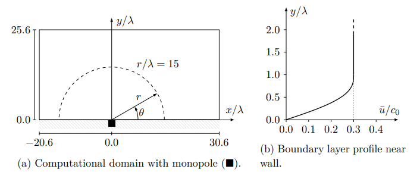
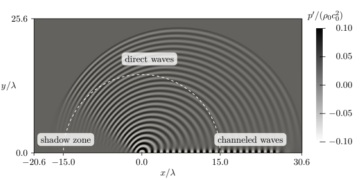
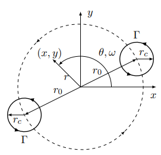
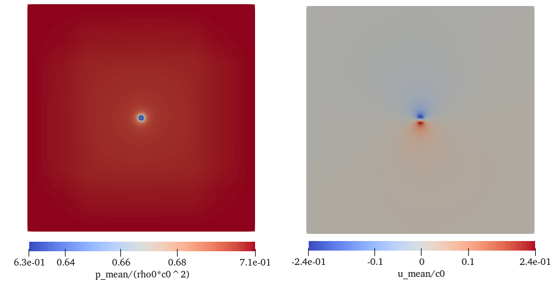
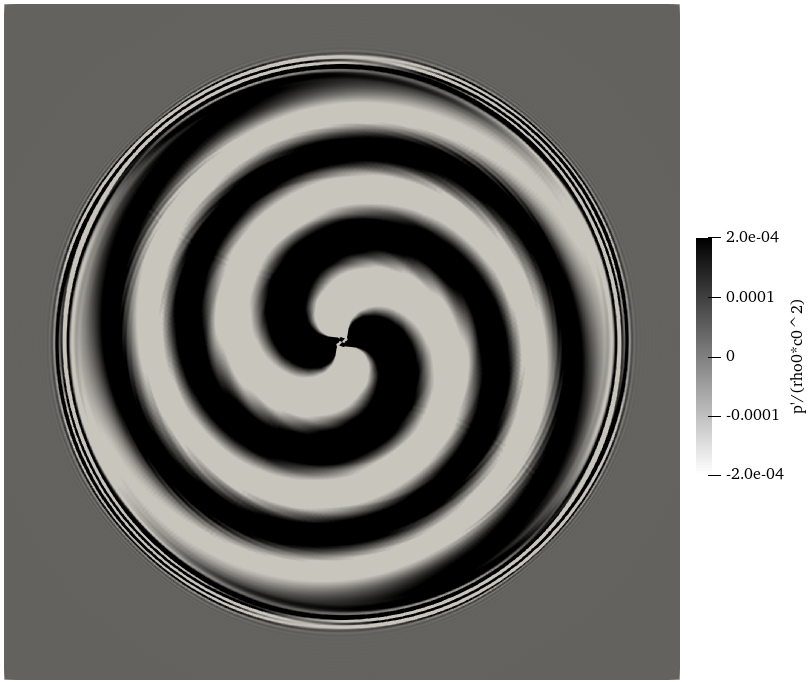

# Tutorial 7 (DG Solver) # {#ugTutorial7cartesian}
[TOC]

In this part, we will run simulations with the Discontinuous Galerkin (DG) solver. The DG solver uses the Discontinuous Galerkin Methods to solve the Acoustic Perturbation Equations (APE) and predict the acoustic field of the investigated configurations. We will first run a simulation with only DG solver and then conduct a coupled simulation between the FV and DG solver.

## Theory
See [Theory & Implementation Discontinuous Galerkin Method (DG) old](http://ldap2.aia.rwth-aachen.de/mediawiki-1.22.1/index.php5/ZFS:Theory_%26_Implementation_Discontinuous_Galerkin_Method_(DG)).

For more details of the equations and test case setups, please refer to our Ph.D. thesis:  
* [Michael Alexander Schlottke-Lakemper, 2017, A Direct-Hybrid
Method for Aeroacoustic Analysis](http://publications.rwth-aachen.de/record/688887/files/688887.pdf)

## Tutorial Part I: Monopole in a boundary layer
### Setup
In part one, we will run a simulation with only the DG solver. For this
purpose, we use the test case that has a monopole sound source in a boundary layer. 

Download the case with the command:
~~~
svn co http://svn.aia.rwth-aachen.de/maia/testcases/DG/2D_monopole_in_boundary_layer
~~~

link your MAIA binary (git version, compiled with gnu compiler in at least production mode <code>./configure 1 2</code>).

### Run
Generate the grid with: 
~~~
./maia properties_grid.toml
~~~

Open <em>properties_run.toml</em> and you can see:
~~~
initialCondition = 2               # describs the boundary layer profile near the wall
ductPosition     = [-0.05, 0.05]   # describs the location and function of the acoustic monopole
~~~

Initialize the simulation with:
~~~
mpirun -np 12 ./maia properties_run.toml
~~~
After the initialization, a <code>solution_00000010.Netcdf</code> will be generated in the <em>/out</em> folder.

Next restart the simulation and run until @f$tc_0/\lambda = 24 @f$:

~~~
mpirun -np 12 ./maia properties_restart.toml
~~~
To prevent long waiting time, a restart fiile at global timestep = 2308 is
provided in the <em>/restart</em> folder. And the simulation runs from timestep 2308 to 2312.

Finally open the <code>solution_00002312.Netcdf</code> in ParaView. Select <code>p</code> in the property box which represents the pressure purturbation @f$p'/(\rho_0c_0^2)@f$ in the APE. The result should be like this:

## Tutorial Part II: Co-rotating vortex pair
### Setup
In the second part, the DG solver is coupled with the FV solver to predict the sound generated by a pair of co-rotating vortices in a quiesent meduim.

Download the case and link you MAIA executeble in the test case folder.
~~~
svn co http://svn.aia.rwth-aachen.de/maia/testcases/DG/2D_spinning_vortex_online_coupling_nonlinear_source
~~~

### Run
**1.Generate mean flow field with the FV solver** 
* Create a new folder to save the mean file: <code>mkdir out/fv_mean</code>  
* In *properties_grid.fv.toml*, change <code>outputDir = "out/fv_mean/"</code>
* Notice this property file generate two similar grid, one for the FV solver, the other for the PostData solver to compute and save mean file.
~~~
noSolvers       = 2
multiSolverGrid = true
~~~
* Generate the grid by <code>./maia properties_grid.fv.toml</code>
* In *properties_run.toml* do the following changes:
~~~
timeSteps      = 10000  # OF TIMESTEPS

outputDir      = "./out/fv_mean/"   # ROOT DIR OF OUTPUT FILES
solutionOutput = "./out/fv_mean/"   # ROOT DIR FOR SOLUTION OUTPUT
#restartDir    = "./restart/fv/"    # Restart directory

pp_averageRestartInterval = 1000    # Restart interval for averaging

restartFile     = false
restartInterval = 1000
~~~
* Run the FV simulation and generate the mean file <code>mpirun -np 12 ./maia properties_run.toml</code>
* Open *out/fv_mean/Mean_s1_00002900-00009450.Netcdf* in ParaView, you can see the generated time averaged flow field.

**2.Run the coupled FV + DG simulation**
* Generate the grid by <code>./maia properties_grid.toml</code>
* In *properties_restart_0.tmol*, change the following properties:
~~~
meanDataFileName = "out/fv_mean/Mean_s1_00002900-00009450.Netcdf"
timeSteps        = 12500
~~~
* Notice <code>sourceTerms = "q_mI"</code> indicates that the coupled simulation reads in the mean file and calculates the perturbed Lamb vector @f$ L' @f$ as the source terms in the acoustic perperbation equaions (APE), where: @f$ q_m = -L'= -(w \times u)'@f$
* Run the coupled simulation <code>mpirun -np 12 ./maia properties_restart_0.toml</code>, this could take a few minutes.
* The solution files of the DG solver is saved in *out/dg/*, open *solution_b1_00012500.Netcdf* in ParaView:
* Adjust the display range of the pressure fluctuation, you can get the following results:

