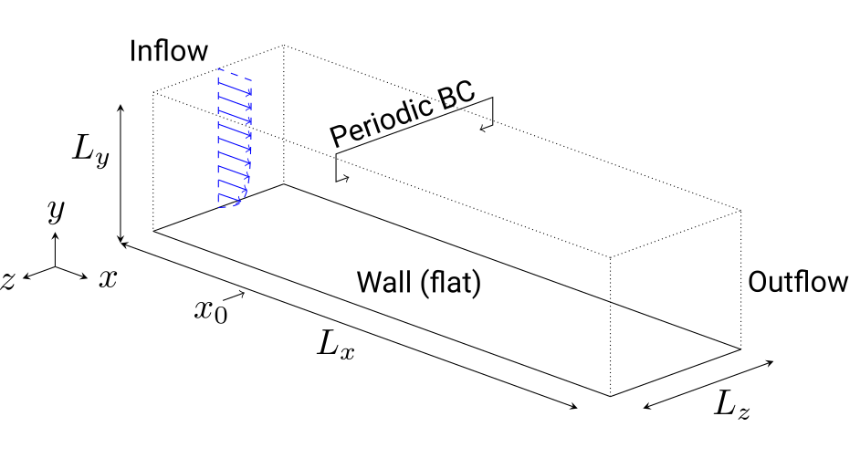
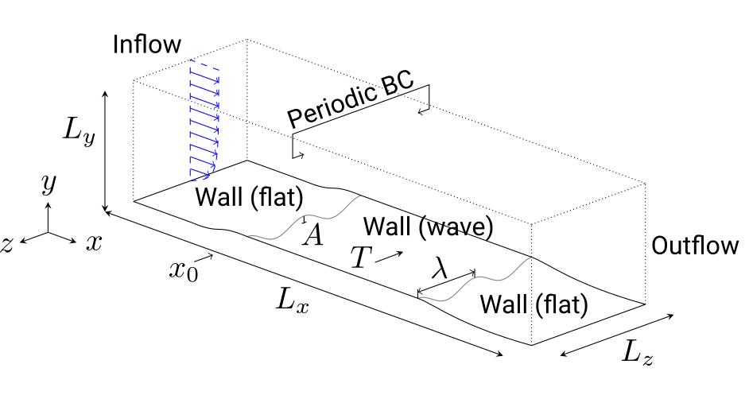
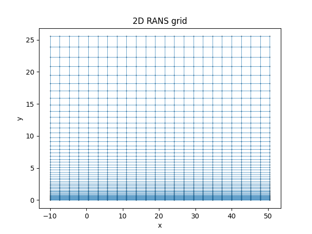
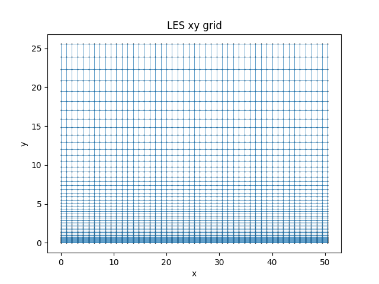
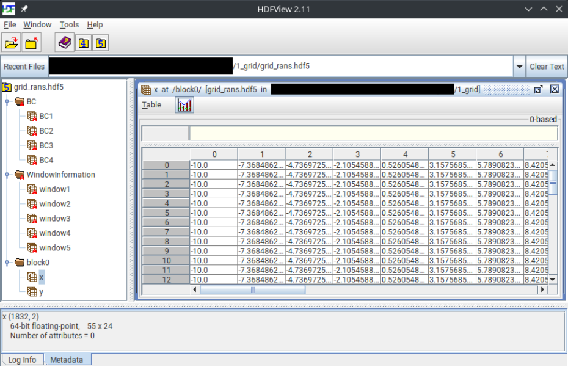
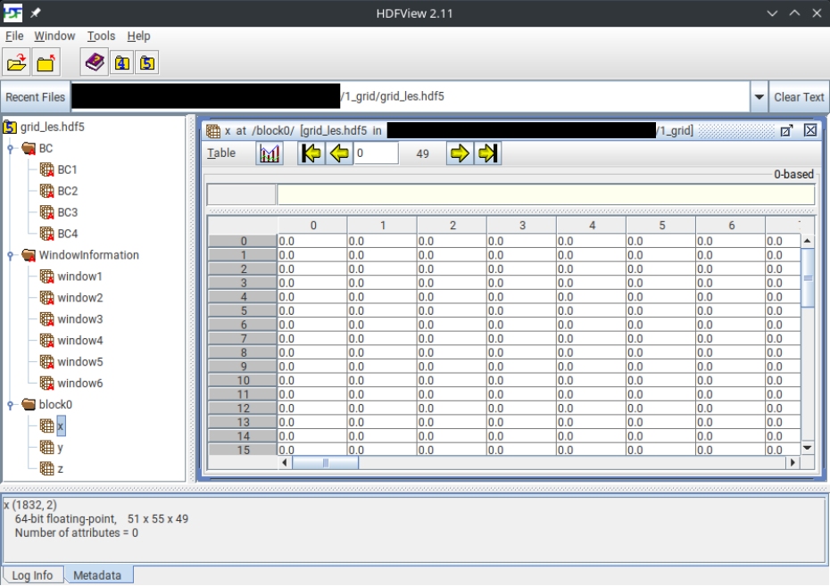

# Structured Tutorial 2 (Grid Generation) # {#ugTutorial2structured}
[TOC]

In this tutorial you will learn how to create a structured body-fitted grids for the simple geometry of the flat plate, which are provided to the MAIA solver in the next tutorials of this series. For that purpose, you will create two grids, i.e., a two-dimensional grid for a Reynolds-Averaged-Navier-Stokes simulation (2D RANS) and a three-dimensional grid for a Large Eddy Simulation (LES) to approximately solve the [Navier-Stokes equations](@ref mmNScompressible) with a [structured finite volume solver](@ref nmSTRCD). For more details about the numerical methods, please refer to the following sections on the [structured grid](@ref nmStructuredGrid) and the [structured finite volume solver](@ref nmSTRCD).

@todo
More information about the tutorial folder structure, if we agreed on one (structure and location where to download from).
~~~
1_grid
2_rans
3...
~~~

## Theory

In the following tutorials, the zero-pressure gradient (ZPG) turbulent boundary layer flow over a wall actuated by a
sinusoidal wave motion is analyzed in a Cartesian domain with the x-axis in the main flow
direction, the y-axis in the wall-normal direction, and the z-axis in the spanwise direction.
All lengths are non-dimensionalized by the momentum thickness of the boundary layer at
\f$ x_0 = 0 \f$ such that \f$ \theta (x_0 = 0) = 1 \f$. The momentum thickness based Reynolds number is
\f$ \mathrm{Re}_{\theta} = u_{\infty} \theta / \nu = 1,000 \f$ at \f$ x_0 \f$. The Mach number is \f$ \mathrm{M} = u_{\infty} / a_{\infty} = 0.1 \f$, i.e., the flow is nearly incompressible.
Starting with the reference resp. unactuated case, the setup is sketched as follows, where BC stands for boundary condition:

At the end of this series of tutorials the wall is actuated by spanwise traveling transversal surface waves to reduce the friction drag. Note that unlike standard ZPG turbulent boundary layer flow, the actuated flow is statistically three-dimensional due to the wave propagating in the \f$ z \f$-direction. More information about the numerical setup and methods can be found in this paper [[Albers2020]].

@note
To reduce computational costs, the grid resolution is decreased in comparison to the real-world simulations, rendering the results less physically plausible.

## Tutorial

1. **Download and unzip this tutorial** [here](...) and change the directory to the grid generation folder `1_grid`.
    ~~~
    cd 1_grid
    ~~~
    
     
    
2. **Create symbolic links** to the compiled MAIA executable (if not already, please refer to the [setup tutorial](@ref ugTutorial1structured)) and to the Python files which are needed to create/make, visualize the grid and to reset/clear the tutorial for the next test run. The last mentioned files are located one level up in the `tools` folder.  
    ~~~
    ln -s maiaDirectory/Solver/src/maia maia
    ln -s ../tools/grid/make_grid.py make_grid.py
    ln -s ../tools/grid/post_grid.py post_grid.py
    ln -s ../tools/grid/clear_grid.py clear_grid.py
    ~~~
    
    Test if MAIA is correctly linked by opening MAIA's help:  
    ~~~
    maia -h
    ~~~
    
     
    
3. **Open** and have a look at the `properties_grid.toml` file, which contains the **settings** used for creating the structured grid.  

    <table>
    <tr><th> Porperty     </th>  <th> Explanation </th></tr>
    <tr><td> ma                   </td>  <td> Mach number \f$ \mathrm{M} = u_{\infty} / a_{\infty} \f$ with the free stream velocity \f$ u_{\infty} \f$ and the speed of sound of the free stream \f$ a_{\infty} \f$</td></tr> 
    <tr><td> re_theta                   </td>  <td> momentum thickness based Reynolds number \f$ \mathrm{Re}_{\theta} = u_{\infty} \theta / \nu \f$ at \f$ x_0 \f$</td></tr>
    <tr><td> les_grid_name             </td>  <td> Name for the 3D LES grid to be generated and saved </td></tr> 
    <tr><td> rans_grid_name          </td>  <td> Name for the 2D RANS grid to be generated and saved </td></tr>
    <tr><td> les   </td>  <td> Boolean if to create a grid for LES </td></tr>
    <tr><td> rans    </td>  <td> Boolean if to create a grid for RANS </td></tr>
    <tr><td> les_inflow_bc </td>  <td> LES inflow boundary condition, `7909` for the synthetic turbulence generation (STG) method. At the initial startup a restart file with a RANS velocity profile and \nu_t profile needs to be provided. The methods computes a given number of synthetic eddies and induces their fluctuations to the mean flow, thus creating turbulent boundary layer flow. Not necessarily needed for `make_grid.py`. </td></tr>
    <tr><td> les_wall_bc                 </td>  <td> LES wall boundary condition, `1000` for no-slip wall </td></tr>
    <tr><td> rans_wall_bc              </td>  <td> RANS wall boundary condition, `1000` for no-slip wall </td></tr>
    <tr><td> les_outflow_bc         </td>  <td> LES outlfow boundary condition, `2004` for subsonic outflow </td></tr>
    <tr><td> rans_outflow_bc         </td>  <td> RANS outlfow boundary condition, `2004` for subsonic outflow </td></tr>
    <tr><td> x_start_rans         </td>  <td> Streamwise starting point of the domain of the RANS </td></tr>
    <tr><td> x_start        </td>  <td> Streamwise starting point of the domain of the LES, i.e., \f$ x_0 = 0 \f$ </td></tr>
    <tr><td> y_wall         </td>  <td> Wall location, i.e., \f$ y = 0 \f$ </td></tr>
    <tr><td> lx_rans         </td>  <td> Streamwise domain size of the RANS </td></tr>
    <tr><td> lx         </td>  <td> Streamwise domain size of the LES </td></tr>
    <tr><td> lx_fringe_start         </td>  <td> Streamwise starting point of the region in which the streamwise grid resolution is coarsened towards the outlfow </td></tr>
    <tr><td> lx_fringe_growth         </td>  <td> Growth factor, like `1.05` for \f$ 5 \% \f$, of the region in which the streamwise grid resolution is coarsened towards the outlfow </td></tr>
    <tr><td> ly         </td>  <td> Wall-normal domain size </td></tr>
    <tr><td> lz_plus         </td>  <td> Spanwise domain size in inner units </td></tr>
    <tr><td> dx_plus         </td>  <td> Streamwise grid resolution in inner units </td></tr>
    <tr><td> dy_plus_wall         </td>  <td> Wall-normal grid resolution at the wall in inner units</td></tr>
    <tr><td> dy_plus_edge         </td>  <td> Wall-normal grid resolution at the edge (distant from the wall) in inner units </td></tr>
    <tr><td> dz_plus         </td>  <td> Spanwise grid resolution in inner units</td></tr>
    <tr><td> rans_stretch         </td>  <td> Stretch factor of the streamwise resolution of the RANS grid in comparison to the LES grid, i.e., `dx_rans = rans_stretch * dx_les` </td></tr>
    <tr><td> bl_edge         </td>  <td> Number of boundary layer edge points </td></tr>
    <tr><td> wall_normal_method         </td>  <td> NOT USED RIGHT NOW IN THE TUTORIAL in `make_grid.py`: Method number of how to construct the wall normal points, i.e., `1,2,3`, where `3` is the method described in the paper [[Albers2020]] </td></tr>
    </table>
    
    @note
    Inner units, which is a non-dimensionalization using the friction velocity \f$ u_{\tau} = \sqrt{ \frac{ \tau_{\mathrm{wall}} }{ \rho } } \f$, i.e., \f$ y^+ = \frac{ y u_{\tau} }{ \nu } \f$ and \f$ u^+ = \frac{ u }{ u_{\tau} } \f$ and \f$ t^+ = \frac{ t u^2_{\tau} }{ \nu } \f$,  are indicated by a \f$+\f$-superscript resp. by `_plus` in the code. For more information, please refer to the "law of the wall".
    
     

4. **Create the grids** used for the next tutorials by running the `make_grid.py` file and using the settings defined in the `properties_grid.toml` file.
    ~~~
    python3 make_grid.py -p properties_grid.toml
    ~~~
    
    When running `make_grid.py` with `properties_grid.toml` the following is printed to the console:
    ~~~
    properties_grid.toml
    40.0
    dy_edge target: 1.052605
    Iteration: 0 Delta at BL-edge: 0.201661 Growth: 1.010808 Inc: 0.808418 Number of points: 137
    Iteration: 1 Delta at BL-edge: 0.212905 Growth: 1.011671 Inc: 0.797735 Number of points: 132
    Iteration: 2 Delta at BL-edge: 0.227074 Growth: 1.012586 Inc: 0.784274 Number of points: 128
    ...
    Iteration: 97 Delta at BL-edge: 1.052605 Growth: 1.067292 Inc: 0.000000 Number of points: 48
    Iteration: 98 Delta at BL-edge: 1.052605 Growth: 1.067292 Inc: 0.000000 Number of points: 48
    Iteration: 99 Delta at BL-edge: 1.052605 Growth: 1.067292 Inc: 0.000000 Number of points: 48
    ######################################
    Re_theta: 800.000000 c_f: 0.004513 tau_w: 0.000022 u_tau: 0.004745
    dx: 1.052605 dy_wall: 0.052630 dz: 0.263151
    y: 0.0 dy: 0.05263027436427487 dy_plus: 2.000000 j: 0
    y: 0.05263027436427487 dy: 0.05617187163979644 dy_plus: 2.134584 j: 1
    y: 0.10880214600407132 dy: 0.059951790136582556 dy_plus: 2.278224 j: 2
    y: 0.16875393614065387 dy: 0.0639860669701171 dy_plus: 2.431531 j: 3
    ...
    y: 20.8808719057816 dy: 1.4577462450731218 dy_plus: 55.395730 j: 51
    y: 22.33861815085472 dy: 1.555840929022883 dy_plus: 59.123421 j: 52
    y: 23.894459079877603 dy: 1.6605366020348529 dy_plus: 63.101955 j: 53
    [51, 55, 49]
    z_max: 500.0000000000
    [55, 24]
    ~~~
    
    
    @note
    Before starting the grid generation again, you need to "clear" (delete) the previously created grids in the current directory, e.g. by running the `clear_grid.py` file. This step is required since `make_grid.py` can not overwrite existing grid files.
    ~~~
    python3 clear_grid.py
    ~~~
    When running `clear_grid.py` the following is printed to the console: 
    ~~~
    ####################
    Clear grid data
    ####################
    Removed grid_rans.hdf5
    Removed grid_les.hdf5
    ~~~
    
     

5. **Have a closer look at the grids** by running the `post_grid.py` file:
    ~~~
    python3 post_grid.py
    ~~~
    
    The created 2D RANS grid should look like this:
    
    
    The x-y-slice of the created 3D LES grid should look like this:
    
    
    As can be seen in the plots above, the grid (mesh) becomes finer near the wall (\f$ y = 0 \f$) than distant from the wall (\f$ y > 0 \f$).
    
    Moreover, some important information and properties are also printed to the console:
    ~~~
    RANS grid size:
    x: 24
    y: 55
    RANS domain size:
    lx = 60.524815518916114
    ly = 25.554995681912455
    RANS grid distances:
    dx = 2.6315137182137436
    dy_wall = 0.05263027436427487
    dy_edge = 1.6605366020348526
    
    LES grid size:
    x: 49
    y: 55
    z: 51
    LES domain size:
    lx = 50.52506338970387
    ly = 25.554995681912455
    lz = 13.157568591068717
    LES grid distances:
    dx = 1.0526054872854975
    dy_wall = 0.05263027436427487
    dy_edge = 1.6605366020348526
    dz = 0.2631513718213743
    ~~~
    
    Alternatively you can open the hdf5 grid files with [HDFView](https://www.hdfgroup.org/downloads/hdfview/) and have a closer look at the data structure used in the hdf5-files.
    ~~~
    hdfview grid_rans.hdf5
    hdfview grid_les.hdf5
    ~~~
    
    When opened with HDFView, the created 2D RANS grid should look like this:
    
    
    When opened with HDFView, the x-y-slice of the created 3D LES grid should look like this:
    
    
     
    

6. **Change some properties** in the `properties_grid.toml` file, such as modifying the domain size using `lx, ly` or coarsening the grid resolution using `dx_plus, dy_plus_wall, dy_plus_edge` or using `lx_fringe_growth = 1.05`, and rerun steps 3 to 5 and have a look how the changed settings affect the created grids. **Tip:** Clear the previously created grids by running `clear_grid.py` and deleting them manually.

     

## References
* Albers, M., Meysonnat, P. S., Fernex, D., Semaan, R., Noack, B. R., & Schröder, W. (2020). Drag reduction and energy saving by spanwise traveling transversal surface waves for flat plate flow. Flow, Turbulence and Combustion, 105(1), 125-157. [https://link.springer.com/article/10.1007/s10494-020-00110-8][Albers2020].

[Albers2020]: https://doi.org/10.1007/s10494-020-00110-8
   

## TODOs
@todo
Revise the make_grid.py file and add more comments and explanations. Remove ZFS namings and unnecessary uncommented code.

@todo
Add information about the dimensions/units: Inner vs. out units. Or at least link to the section, where the units are explained.

- Formula of how the wave propagates. Maybe just add this to the actuated LES tutorial.

