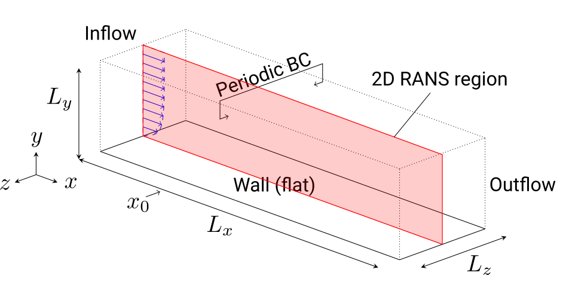
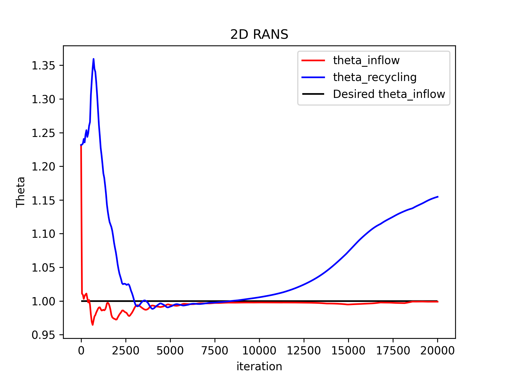
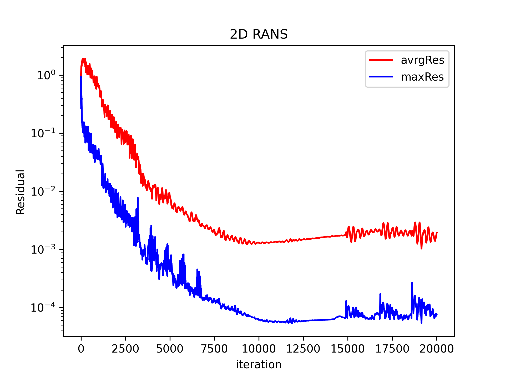
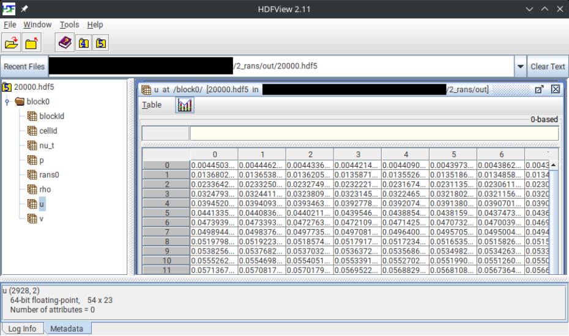
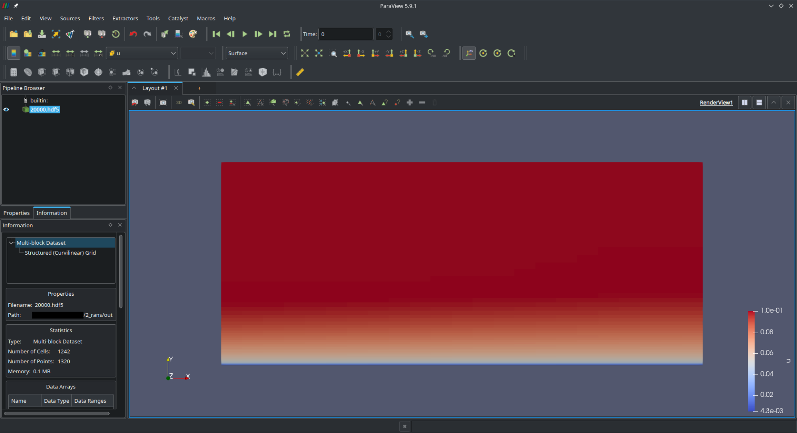
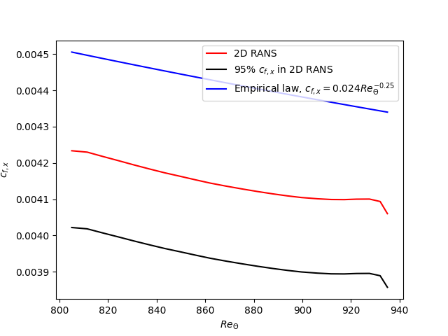
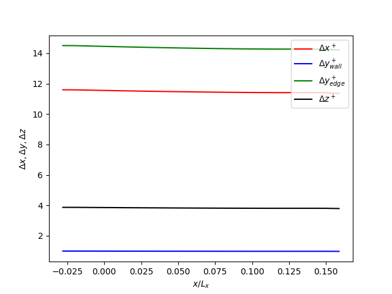

# Structured Tutorial 3 (2D RANS) # {#ugTutorial3structured}
[TOC]

In this tutorial you will learn how to run a two-dimensional Reynolds-Averaged-Navier-Stokes simulation (2D RANS) of the (unactuated) flat plate using the 2D structured grid created in the [previous tutorial](@ref ugTutorial2structured). For more details about the numerical methods, please refer to the following sections on the [structured grid](@ref nmStructuredGrid) and the [structured finite volume solver](@ref nmSTRCD).

## Theory

The figure below provides an overview of the unactuated flat plate used for the 2D RANS. More information about the numerical setup and methods can be found in this paper [[Albers2020]].

## Tutorial

This tutorial is split into two parts, one for runnning the 2D RANS and one for post-processing the simulations results with focus on the skin friction coefficient.

### Run the 2D RANS

1. **Download and unzip this tutorial** [here](...) and change the directory to the 2D RANS folder `2_rans`:
    ~~~
    cd 2_rans
    ~~~
    
     
    
2. **Create symbolic links** to the compiled MAIA executable (if not already, please refer to the [setup tutorial](@ref ugTutorial1structured)), the 2D RANS grid created in the [previous tutorial](@ref ugTutorial2structured) and to the Python files which are needed to plot/analyze the convergence and to reset/clear the tutorial for the next test run. The last mentioned files are located one level up in the `tools` folder:  
    ~~~
    ln -s maiaDirectory/Solver/src/maia maia
    ln -s ../1_grid/grid_rans.hdf5 grid_rans.hdf5
    ln -s ../tools/rans/plot_rans_convergence.py plot_rans_convergence.py
    ln -s ../tools/rans/clear_rans.py clear_rans.py
    ~~~
    
    Test if MAIA is correctly linked by opening MAIA's help:  
    ~~~
    maia -h
    ~~~
    
     
    
3. **Open** and have a look at the `properties_run_rans.toml` file, which contains the **settings** used for running the 2D RANS with the structured grid:  

    <table>
    <tr><th> Porperty     </th>  <th> Explanation </th></tr>
    <tr><td> Ma                   </td>  <td> Mach number </td></tr> 
    <tr><td> Re                   </td>  <td> momentum thickness based Reynolds number \f$ \mathrm{Re}_{\theta} = u_{\infty} \theta / \nu \f$ at \f$ x_0 \f$ </td></tr>
    <tr><td> gridInputFileName                   </td>  <td> Structured grid file used for the 2D RANS, like `"./grid_rans.hdf5"` </td></tr>
    <tr><td> solutionOutput                   </td>  <td> Output directory for solution files, like `"./out/"` </td></tr>
    <tr><td> restartVariablesFileName                   </td>  <td> Name of the restart file to restart/continue the simulation, like `"./restart_rans.hdf5"` </td></tr> 
    <tr><td> timeSteps                   </td>  <td> Final number of timesteps to simulate, e.g., `20000` </td></tr> 
    <tr><td> solutionInterval                   </td>  <td> Output interval in timesteps resp. interval after which the solutions are saved every time, e.g., `10000` </td></tr> 
    <tr><td> \ref rescalingBLT                  </td>  <td> Rescaling factor concerning the boundary layer theory, delta99 at the inflow </td></tr>
    <tr><td> fullRANS     </td>  <td> Boolean for using RANS, i.e., `true` </td></tr>
    <tr><td> ransMethod                   </td>  <td> RANS method, e.g., `"RANS_SA_DV"` for the [Spalart-Allmaras turbulence model](https://en.wikipedia.org/wiki/Spalart%E2%80%93Allmaras_turbulence_model)??? </td></tr> 
    <tr><td> solvertype.0                   </td>  <td> Solver part of MAIA, e.g., `"MAIA_STRUCTURED"` for the structured finite volume solver </td></tr> 
    </table>
    
     

4. **Run the 2D RANS** in sequence with the following command:
    ~~~
    maia properties_run_rans.toml
    ~~~
    
    **Tip:** Allocate some computational resources for running the 2D RANS. By utilizing OpenMPI you can run the simulation in parallel using `noCores` processors:
    ~~~
    mpirun -np noCores maia properties_run_rans.toml
    ~~~
    
    @note
    With a 12 core node (which processors???) the simulation should take about 5 minutes. Check that!!!
    
    The print message on the console should look like this:
    ~~~
    
    Global MPI information
    MPI Info: nkeys = 1
    MPI Info: [0] key = nc_header_align_size, value = 10240
        _____ ______    ________   ___   ________                             
    ____|\   _ \  _   \ |\   __  \ |\  \ |\   __  \ ___                   
     ___\ \  \\\__\ \  \\ \  \|\  \\ \  \\ \  \|\  \ ___    
      ___\ \  \\|__| \  \\ \   __  \\ \  \\ \   __  \ ___         
       ___\ \  \    \ \  \\ \  \ \  \\ \  \\ \  \ \  \ ___    
        ___\ \__\    \ \__\\ \__\ \__\\ \__\\ \__\ \__\ ___    
         ___\|__|     \|__| \|__|\|__| \|__| \|__|\|__| ____               

    Start time:            2023-02-02 13:57:31
    Number of ranks:       12
    Number of OMP threads: 36
    Host (of rank 0):      aia315
    Working directory:     maiaTutorialDirectory/2_rans
    User:                  YourName
    Executable:            maia
    Command line args:     maia properties_run_rans.toml

    m_noSolvers: 1

    === MAIA RUN LOOP ===

    === MAIA RUN DURATION: Create geometries                   | min: 6.9141e-06 s | avg: 9.4970e-06 s | max: 1.2875e-05 s |
    === Create grid...
    === Create structured grid...
    === done.
    === MAIA RUN DURATION: Create grid                         | min: 3.6001e-05 s | avg: 4.4008e-05 s | max: 5.1022e-05 s |
    FV-MB is off
    FV-LS is off
    LB is off
    LB LS is off
    LS SOLVER is off
    COMBUSTION is off
    DG is off
    LS-RANS is off
    === Create solvers...
    === Create structured solver...
    Initializing Structured Solver...
    Doing  block decomposition...
    === PARALLELIO FILE LIFETIME: ./grid_rans.hdf5                    | 8.7371e-03 s |
    Doing  block decomposition... SUCCESSFUL!
    === PARALLELIO FILE LIFETIME: ./grid_rans.hdf5                    | 2.3416e-02 s |
    === PARALLELIO FILE LIFETIME: ./grid_rans.hdf5                    | 1.6129e-03 s |
    === PARALLELIO FILE LIFETIME: ./grid_rans.hdf5                    | 7.7295e-04 s |
    Starting grid connection info search...
    Reading in all coordinates of all block faces
    offset[1]=0 offset[0]=0
    size[1]=1 size[0]=55
    offset[1]=23 offset[0]=0
    size[1]=1 size[0]=55
    Loading periodic face coordinates
    Building up connections for multiblock connection search
    Computing periodic window displacements
    we have evenSides 0 and we have oddSides 0 in BlockId 0
    we have evenSides 0 and we have oddSides 0 in BlockId 0
    
    ...
    
    === MAIA RUN DURATION: Full initialization                 | min: 1.8187e-01 s | avg: 1.8256e-01 s | max: 1.8283e-01 s |
    0 ThetaInflow 1.00631463 ThetaRecyclingStation 1.23224041
    0 ThetaInflow 1.00480941 ThetaRecyclingStation 1.23369011
    0 ThetaInflow 0.99865672 ThetaRecyclingStation 1.24080552
    0 ThetaInflow 1.00309626 ThetaRecyclingStation 1.23554359

    ...
    
    0 ThetaInflow 0.99898883 ThetaRecyclingStation 1.15095399
    0 ThetaInflow 0.99897972 ThetaRecyclingStation 1.15149712
    0 ThetaInflow 0.99898169 ThetaRecyclingStation 1.15201301
    0 ThetaInflow 0.99897661 ThetaRecyclingStation 1.15251365
    0 ThetaInflow 0.99897937 ThetaRecyclingStation 1.15299482
    0 ThetaInflow 0.99898358 ThetaRecyclingStation 1.15345305
    0 ThetaInflow 0.99898784 ThetaRecyclingStation 1.15389335
    0 ThetaInflow 0.99900187 ThetaRecyclingStation 1.15430812
    0 ThetaInflow 0.99902361 ThetaRecyclingStation 1.15469164
    === PARALLELIO FILE LIFETIME: ./out/auxData20000.hdf5             | 1.4262e-02 s |
    === PARALLELIO FILE LIFETIME: ./out/20000.hdf5                    | 2.1094e-02 s |

    ******************************* MEMORY STATISTICS *******************************
    ***** Comment: After run loop - #ranks: 12
    ***** Location: void MAIAApplication::run() [with int nDim = 2] (maiaDirectory/Solver/src/application.cpp:1137)
    ***** 
    ***** Average memory usage: physical = 27.7067 MB; allocation = 77.0055 MB
    ***** Minimun memory usage: physical = 26.8281 MB; allocation = 74.9492 MB
    ***** Maximum memory usage: physical = 34.2188 MB; allocation = 99.0977 MB
    ***** Maximum diff in memory usage: physical = 34.2188 MB; allocation = 99.0977 MB
    ***** Total physical memory usage (RAM): 0.324688 GB
    ***** Diff total physical memory usage (RAM): 0.324688 GB
    ***** Total allocation size (Virtual Memory): 0.902409 GB
    ***** Diff total allocation size (Virtual Memory): 0.902409 GB
    ***** 
    ***** Maximum stack memory: 136 KB; stack limit 8192 KB
    ***** 
    ***** Minimum available memory per node (meminfo): 196.453 GB
    ***** Minimum free memory per node (RAM): 63.5602 GB
    ******************************* MEMORY STATISTICS *******************************
    ~~~
    
    Running the simulation results in the following files:
    
    <table>
    <tr><th> File(s)                        </th>  <th> Explanation </th></tr>
    <tr><td> 2_rans/out/SomeTimestep.hdf5     </td>  <td> Solution files for predefined timestep intervals, like `10000.hdf5` </td></tr>
    <tr><td> 2_rans/out/auxData20000.hdf5     </td>  <td> Auxiliary solution files for the final timestep. Purpose??? </td></tr>
    <tr><td> 2_rans/maia_log                  </td>  <td> Log file containing information of how the simulation has run </td></tr> 
    <tr><td> 2_rans/Residual                   </td>  <td> Residuals of the simulation for every timestep </td></tr> 
    <tr><td> 2_rans/theta_inflow.dat          </td>  <td> Momentum-based boundary layer thickness \f$ \delta_2 = \theta \f$ at \f$ x_0 = 0 \f$ for every timestep </td></tr> 
    </table>
    
     
        
5. **Check** if the solution is converged and if \f$ \delta_2 (x_0 = 0)  = \theta (x_0 = 0) = 1 \f$, i.e., `ThetaInflow = d2(x=0) = 1`:

    ~~~
    python3 plot_rans_convergence.py
    ~~~

    The momentum-based boundary layer thickness \f$ \delta_2 (x_0 = 0)  = \theta (x_0 = 0) \f$ at the inflow \f$ x_0 = 0 \f$ against the number of timesteps should look like this:
    
    
    The residuals against the number of timesteps should look like this:
    
    
6. **If not converged** rerun/continue the RANS with a larger number of timesteps in `properties_run_rans.toml`:

    Rerun the RANS:
    ~~~
    python3 clear_rans.py
    ~~~
    Open `properties_run_rans.toml`, increase the number of timesteps denoted as the porperty `timeSteps`, save it and jump to step 4.
    
    
    Restart/Continue from the current RANS:
    How to continue??? Do we even need to show that???
    Currently no restart file created/used!
    
     
    
7. **If not d2(x=0)=1** adjust `rescalingBLT` parameter in `properties_run_rans.toml` and rerun the 2D RANS until `ThetaInflow = d2(x=0) = 1`. This condition must be meet to achieve the desired and predefined Reynolds number. The following rule of thumb can be used to select the new rescaling factor based on the previous/old converged `ThetaInflow`:

    Condition to meet:
    ~~~
    1 = ThetaInflow_converged_new = ThetaInflow_converged_old / rescalingBLT_old * rescalingBLT_new
    ~~~
    
    Resulting rule of thumb to select the new rescaling factor `rescalingBLT_new`:
    ~~~
    rescalingBLT_new = rescalingBLT_old / ThetaInflow_converged_old
    ~~~
    
    Rerun the RANS:
    ~~~
    python3 clear_rans.py
    ~~~
    Open `properties_run_rans.toml`, change the boundary layer rescaling factor denoted as the porperty `rescalingBLT` to the value of the newly computed `rescalingBLT_new`, save it and jump to step 4.
    
     
    
8. Check plausibility of the flow:  

    Check the last hdf5-solution file `LastTimestep.hdf5`, e.g., `20000.hdf5`, with [HDFView](https://www.hdfgroup.org/downloads/hdfview/)
    ~~~
    cd out
    hdfview LastTimestep.hdf5
    ~~~
    
    The hdf5-solution file should look like this:
    
    
    or with [ParaView](https://www.paraview.org/)
    ~~~
    cd out
    parav LastTimestep.hdf5
    ~~~
    
    The hdf5-solution file should look like this when using the \f$ u \f$ velocity component and the visualization as a surface:
    
    
     

### Post-process the 2D RANS

1. **Download and unzip `bltools.py`** in the `tools` folder:
    Currently, `bltools.py` and the corresponding post-processing scripts are located in `tools`. Where to get the newest version of `bltools.py`: https://git.rwth-aachen.de/aia/MAIA/tools/-/tree/master/postprocessing/structured/blpp

     
    
2. Change the directory to the post-processing folder `post` and **create symbolic links to the post-processing scripts** in the `tools` folder. Currently the `data` is not created automatically, therefore it has to be created by the user with `mkdir data`:
    ~~~
    cd ..
    cd post
    ln -s ../../tools/bltools.py bltools.py
    ln -s ../../tools/rans/plot_cf_rans.py plot_cf_rans.py
    ln -s ../../tools/rans/plot_delta_xyz_plus.py plot_delta_xyz_plus.py
    mkdir data
    ~~~
    
     
    
3. **Run the post-processing evaluation file** `eval_rans.py`, for example to calculate the streamwise skin friction coefficient \f$ c_{f,x} = \frac{ 2 \tau_{\mathrm{wall}} }{ \rho_{\infty} v^2_{\infty} }\f$ (local drag coefficient):
    ~~~
    python3 eval_rans.py
    ~~~
    
    The print message on the console should look like this:
    ~~~
    NumPy version: 1.17.3
    ############################
    ######## PARAMETERS ########
    ############################
    MA:  0.1
    RE:  800.0 <- for the grid a different Reynolds number was used. Adjust it!
    T8:  0.998003992015968
    U8:  0.0999001497504367
    RHO8:  0.9950174476440005
    MUE8:  0.9984267285780992
    RE0:  8035.434224461798
    P8:  0.7093081320530371
    Base folder:  ../
    Grid folder:  ../
    Solutionfolder:  ../out/
    Output folder:  ./data/
    Output name:  reference
    Case type is  ref
    Loading grid...
    Dimensions in grid file:  2
    noPointsJ:  55  noPointsI:  24
    Loading grid... FINISHED!
    Computing cell centers...
    Computing cell centers... FINISHED!
    ############################
    Loading 2D postprocessing variables...
    no_cells[0]:  54  no_cells[1]:  23
    Loading 2D postprocessing variables...  FINISHED!
    no_cells[J]:  54  no_cells[I]:  23
    Computing wall properties...
    Computing wall properties... FINISHED!
    Computing wall shear stress...
    Computing wall shear stress... FINISHED!
    Begin searching streamwise position...
    current J:  0  current I:  1
    grid.no_cells[0]:  -1  grid.no_cells[1]:  54  grid.no_cells[2]:  23
    Attention!! Grid coordinate is still with : K 0 J 1 I 2
    [3, 7]
    Successfully find streamwise positions with ipos...  FINISHED!
    Computing velocity distribution...
    Computing velocity distribution... FINISHED!
    ~~~
    
    The resulting files are:
    
    <table>
    <tr><th> File(s)                        </th>  <th> Explanation </th></tr>
    <tr><td> 2_rans/post/data/bl_reference.dat   </td>  <td> Boundary layer reference data </td></tr>
    <tr><td> 2_rans/post/data/profile_reference_iposNum.dat   </td>  <td>  Post-processing results at certain i-positions </td></tr>
    </table>
    
    @note
    In principle the `bl_reference.npz` contains the same information as the `bl_reference.dat`, but consisting of multiple zipped `npy`-files tailored to the use of Python.
    
     
    
4. **Visualize the drag coefficient** and check if the 2D RANS results are porper to use for the next tutorial dealing with the Synthetic Turbulence Generation (STG):
    ~~~
    python3 plot_cf_rans.py
    ~~~
    
    What means proper (comparison with the empirical law) and why 95% of the empirical law? And where does the empirical formula come from?  
    
    
     
    
    
5. **Check the evolution of the grid resolution** along the streamwise direction:
    ~~~
    python3 plot_delta_xyz_plus.py
    ~~~
    
    The resulting plot should look like this:  
    
    
    @note
    The grid resolution at the wall is much finer than the resolution distant from the wall, since we want to resolve the turbulent flow at the wall.
    
    @todo
    Adjust units displayed by the plot method.
    
     
    
    
# TODOs

- Rerun the simulation with re=1000 instead of re=800, and update the printed messages on the console and the images!
- Change the big theta \f$ \Theta \f$ to the small one \f$ \theta \f$ in the plots
    

## References
* Albers, M., Meysonnat, P. S., Fernex, D., Semaan, R., Noack, B. R., & Schröder, W. (2020). Drag reduction and energy saving by spanwise traveling transversal surface waves for flat plate flow. Flow, Turbulence and Combustion, 105(1), 125-157. [https://link.springer.com/article/10.1007/s10494-020-00110-8][Albers2020].

[Albers2020]: https://doi.org/10.1007/s10494-020-00110-8

